# Connections: who talks to whom

Solid arrow: the app uses (depends on) the other. Dotted arrow: it talks to or is controlled by the other. Only edges where both ends are apps on this map are drawn. One graph per category (dashed boxes are apps of other categories, shown only as stubs), then the most connected apps, then the planned Light Control. The full edge list is at the end.

## Most connected apps

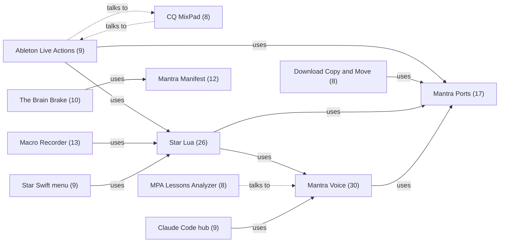
```mermaid
graph LR
  n0["Ableton Live Actions (9)"]
  n1["CQ MixPad (8)"]
  n2["Mantra Ports (17)"]
  n3["Star Lua (26)"]
  n4["The Brain Brake (10)"]
  n5["Mantra Manifest (12)"]
  n6["Download Copy and Move (8)"]
  n7["Macro Recorder (13)"]
  n8["Mantra Voice (30)"]
  n9["MPA Lessons Analyzer (8)"]
  n10["Star Swift menu (9)"]
  n11["Claude Code hub (9)"]
  n0 -.->|"talks to"| n1
  n0 -->|"uses"| n2
  n0 -->|"uses"| n3
  n4 -->|"uses"| n5
  n1 -.->|"talks to"| n0
  n6 -->|"uses"| n2
  n7 -->|"uses"| n3
  n3 -->|"uses"| n2
  n3 -->|"uses"| n8
  n8 -->|"uses"| n2
  n9 -.->|"talks to"| n8
  n10 -->|"uses"| n3
  n11 -->|"uses"| n8
```

| Links | App |
|---|---|
| 30 | [Mantra Voice (speech server)](apps/MANTRA_VOICE.md) |
| 26 | [Star (Mantra), Lua (Hammerspoon, legacy)](apps/MANTRA_STAR.md) |
| 17 | [Mantra Ports](apps/MANTRA_PORTS.md) |
| 13 | [Macro Recorder (Mantra)](apps/MANTRA_MACRO.md) |
| 12 | [Mantra Manifest](apps/MANTRA_MANIFEST.md) |
| 10 | [Mantra Manual Camera](apps/mantra-manual-camera.md) |
| 10 | [The Brain Brake (film repository)](apps/BRAIN_BRAKE.md) |
| 9 | [Ableton Live Actions (Mantra)](apps/ABLETON_LIVE_ACTIONS.md) |
| 9 | [Claude Code hub](apps/claude-code.md) |
| 9 | [Star (Mantra), Swift menu](apps/STAR_SWIFT.md) |
| 8 | [CQ MixPad (Mantra)](apps/CQ_MIXPAD_MANTRA.md) |
| 8 | [Download, Copy and Move (Mantra) (was Download Monitor)](apps/DOWNLOAD_MONITOR.md) |
| 8 | [MPA Lessons Analyzer](apps/MPA_LESSONS_ANALYZER.md) |
| 7 | [Chromium Virtual Machine (Mantra)](apps/vm-chromium.md) |
| 7 | [Keyring](apps/KEYRING_TERMUX.md) |

## Voice, dictation and transcription

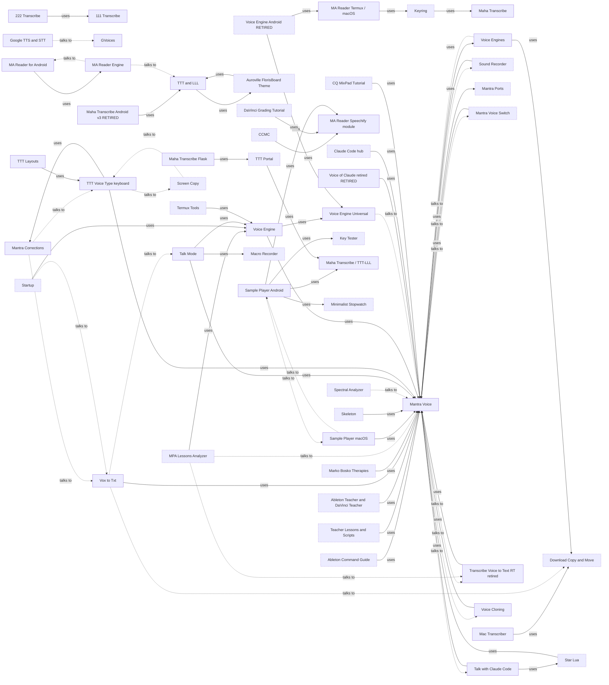
```mermaid
graph LR
  n0["222 Transcribe"]
  n1["111 Transcribe"]
  n2["Ableton Command Guide"]
  n3["Mantra Voice"]
  n4["Teacher Lessons and Scripts"]
  n5["CCMC"]
  n6["MA Reader Speechify module"]
  n7["TTT and LLL"]
  n8["Auroville FlorisBoard Theme"]
  n9["Google TTS and STT"]
  n10["GVoices"]
  n11["Keyring"]
  n12["Maha Transcribe"]
  n13["Mac Transcriber"]
  n14["Download Copy and Move"]
  n15["Maha Transcribe Android v3 RETIRED"]
  n16["Maha Transcribe Flask"]
  n17["TTT Portal"]
  n18["Mantra Corrections"]
  n19["Vox to Txt"]
  n20["TTT Voice Type keyboard"]
  n21["Screen Copy"]
  n22["Sound Recorder"]
  n23["Star Lua"]
  n24["Ableton Teacher and DaVinci Teacher"]
  n25["Mantra Ports"]
  n26["Mantra Voice Switch"]
  n27["Transcribe Voice to Text RT retired"]
  n28["Talk with Claude Code"]
  n29["Voice Cloning"]
  n30["Voice Engines"]
  n31["Talk Mode"]
  n32["Marko Bosko Therapies"]
  n33["MA Reader for Android"]
  n34["MA Reader Engine"]
  n35["MA Reader Termux / macOS"]
  n36["MPA Lessons Analyzer"]
  n37["Voice Engine"]
  n38["DaVinci Grading Tutorial"]
  n39["Sample Player Android"]
  n40["Key Tester"]
  n41["Maha Transcribe / TTT-LLL"]
  n42["Minimalist Stopwatch"]
  n43["Sample Player macOS"]
  n44["Skeleton"]
  n45["Spectral Analyzer"]
  n46["Startup"]
  n47["Macro Recorder"]
  n48["Voice Engine Universal"]
  n49["Voice Engine Android RETIRED"]
  n50["Voice of Claude retired RETIRED"]
  n51["Claude Code hub"]
  n52["CQ MixPad Tutorial"]
  n53["Termux Tools"]
  n54["TTT Layouts"]
  n0 -->|"uses"| n1
  n2 -->|"uses"| n3
  n4 -->|"uses"| n3
  n5 -->|"uses"| n6
  n7 -->|"uses"| n8
  n9 -.->|"talks to"| n10
  n11 -->|"uses"| n12
  n13 -->|"uses"| n14
  n15 -->|"uses"| n7
  n16 -->|"uses"| n17
  n18 -.->|"talks to"| n19
  n18 -.->|"talks to"| n20
  n21 -.->|"talks to"| n20
  n22 -->|"uses"| n3
  n23 -->|"uses"| n3
  n24 -->|"uses"| n3
  n3 -->|"uses"| n25
  n3 -.->|"talks to"| n22
  n3 -.->|"talks to"| n26
  n3 -.->|"talks to"| n27
  n3 -.->|"talks to"| n28
  n3 -.->|"talks to"| n29
  n3 -->|"uses"| n30
  n26 -->|"uses"| n3
  n19 -.->|"talks to"| n14
  n19 -->|"uses"| n3
  n19 -.->|"talks to"| n31
  n32 -->|"uses"| n3
  n27 -->|"uses"| n3
  n33 -->|"uses"| n34
  n34 -.->|"talks to"| n7
  n34 -.->|"talks to"| n33
  n35 -->|"uses"| n11
  n36 -.->|"talks to"| n3
  n36 -.->|"talks to"| n27
  n36 -->|"uses"| n37
  n38 -->|"uses"| n6
  n39 -->|"uses"| n40
  n39 -->|"uses"| n41
  n39 -->|"uses"| n6
  n39 -->|"uses"| n42
  n39 -.->|"talks to"| n43
  n43 -->|"uses"| n3
  n43 -.->|"talks to"| n39
  n44 -->|"uses"| n3
  n45 -.->|"talks to"| n3
  n46 -.->|"talks to"| n19
  n46 -->|"uses"| n37
  n31 -->|"uses"| n47
  n31 -->|"uses"| n3
  n31 -->|"uses"| n37
  n28 -->|"uses"| n23
  n28 -->|"uses"| n3
  n20 -->|"uses"| n18
  n20 -.->|"talks to"| n21
  n20 -->|"uses"| n3
  n17 -->|"uses"| n41
  n29 -->|"uses"| n3
  n37 -->|"uses"| n3
  n37 -->|"uses"| n48
  n30 -->|"uses"| n14
  n30 -.->|"talks to"| n3
  n49 -->|"uses"| n35
  n49 -->|"uses"| n48
  n48 -.->|"talks to"| n3
  n50 -->|"uses"| n3
  n8 -->|"uses"| n7
  n51 -->|"uses"| n3
  n52 -->|"uses"| n3
  n53 -->|"uses"| n37
  n54 -->|"uses"| n20
  classDef stub stroke-dasharray: 3 3
  class n2,n4,n5,n8,n11,n14,n17,n21,n22,n23,n24,n25,n26,n32,n36,n38,n40,n42,n44,n45,n46,n47,n49,n51,n52,n53 stub
```

## Audio, music and DJ

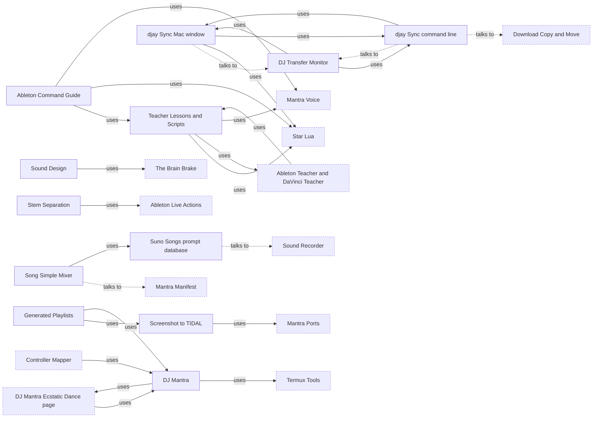
```mermaid
graph LR
  n0["Ableton Command Guide"]
  n1["Teacher Lessons and Scripts"]
  n2["Star Lua"]
  n3["Mantra Voice"]
  n4["Ableton Teacher and DaVinci Teacher"]
  n5["djay Sync Mac window"]
  n6["DJ Transfer Monitor"]
  n7["djay Sync command line"]
  n8["Screenshot to TIDAL"]
  n9["Mantra Ports"]
  n10["Sound Design"]
  n11["The Brain Brake"]
  n12["Stem Separation"]
  n13["Ableton Live Actions"]
  n14["Suno Songs prompt database"]
  n15["Sound Recorder"]
  n16["Song Simple Mixer"]
  n17["Mantra Manifest"]
  n18["Download Copy and Move"]
  n19["DJ Mantra Ecstatic Dance page"]
  n20["DJ Mantra"]
  n21["Termux Tools"]
  n22["Generated Playlists"]
  n23["Controller Mapper"]
  n0 -->|"uses"| n1
  n0 -->|"uses"| n2
  n0 -->|"uses"| n3
  n1 -->|"uses"| n2
  n1 -->|"uses"| n4
  n1 -->|"uses"| n3
  n5 -.->|"talks to"| n6
  n5 -->|"uses"| n2
  n5 -->|"uses"| n7
  n6 -->|"uses"| n5
  n6 -->|"uses"| n7
  n4 -->|"uses"| n1
  n8 -->|"uses"| n9
  n10 -->|"uses"| n11
  n12 -->|"uses"| n13
  n14 -.->|"talks to"| n15
  n16 -.->|"talks to"| n17
  n16 -->|"uses"| n14
  n7 -->|"uses"| n5
  n7 -.->|"talks to"| n6
  n7 -.->|"talks to"| n18
  n19 -->|"uses"| n20
  n20 -->|"uses"| n19
  n20 -->|"uses"| n21
  n22 -->|"uses"| n8
  n22 -->|"uses"| n20
  n23 -->|"uses"| n20
  classDef stub stroke-dasharray: 3 3
  class n2,n3,n4,n9,n11,n13,n15,n17,n18,n19,n21,n23 stub
```

## Mixers, MIDI and audio hardware

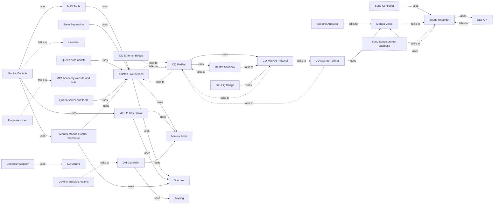
```mermaid
graph LR
  n0["Ableton Live Actions"]
  n1["CQ MixPad"]
  n2["Mantra Ports"]
  n3["Star Lua"]
  n4["Suno Controller"]
  n5["Sound Recorder"]
  n6["CQ Ethernet Bridge"]
  n7["Mantra Sandbox"]
  n8["CQ MixPad Protocol"]
  n9["DaVinci Resolve Actions"]
  n10["Oxi Controller"]
  n11["Mantra Controls"]
  n12["MIDI Tools"]
  n13["MIDI to Key Stroke"]
  n14["Launcher"]
  n15["Mantra Mackie Control Translator"]
  n16["Mantra Voice"]
  n17["Star API"]
  n18["Plugin Assistant"]
  n19["MPA Academy website and hub"]
  n20["Spectral Analyzer"]
  n21["Stem Separation"]
  n22["Suno Songs prompt database"]
  n23["CQ MixPad Tutorial"]
  n24["Queen auto-update"]
  n25["Queen server and tools"]
  n26["Controller Mapper"]
  n27["DJ Mantra"]
  n28["Keyring"]
  n29["OXI-CQ Bridge"]
  n0 -.->|"talks to"| n1
  n0 -->|"uses"| n2
  n0 -->|"uses"| n3
  n4 -->|"uses"| n5
  n6 -.->|"talks to"| n1
  n1 -.->|"talks to"| n0
  n1 -->|"uses"| n7
  n1 -->|"uses"| n8
  n9 -.->|"talks to"| n10
  n11 -->|"uses"| n12
  n11 -->|"uses"| n13
  n11 -.->|"talks to"| n14
  n11 -->|"uses"| n15
  n12 -->|"uses"| n0
  n7 -.->|"talks to"| n1
  n7 -.->|"talks to"| n8
  n5 -->|"uses"| n16
  n5 -->|"uses"| n17
  n16 -.->|"talks to"| n5
  n13 -->|"uses"| n2
  n13 -->|"uses"| n3
  n18 -.->|"talks to"| n19
  n20 -.->|"talks to"| n16
  n17 -.->|"talks to"| n5
  n21 -->|"uses"| n0
  n22 -.->|"talks to"| n5
  n8 -.->|"talks to"| n1
  n8 -.->|"talks to"| n23
  n23 -.->|"talks to"| n1
  n23 -->|"uses"| n16
  n24 -->|"uses"| n0
  n25 -->|"uses"| n0
  n15 -->|"uses"| n0
  n15 -->|"uses"| n3
  n26 -->|"uses"| n27
  n10 -->|"uses"| n28
  n10 -->|"uses"| n2
  n29 -->|"uses"| n8
  classDef stub stroke-dasharray: 3 3
  class n2,n3,n4,n7,n9,n14,n16,n17,n19,n21,n22,n24,n25,n27,n28 stub
```

## Camera, video, NDI and streaming

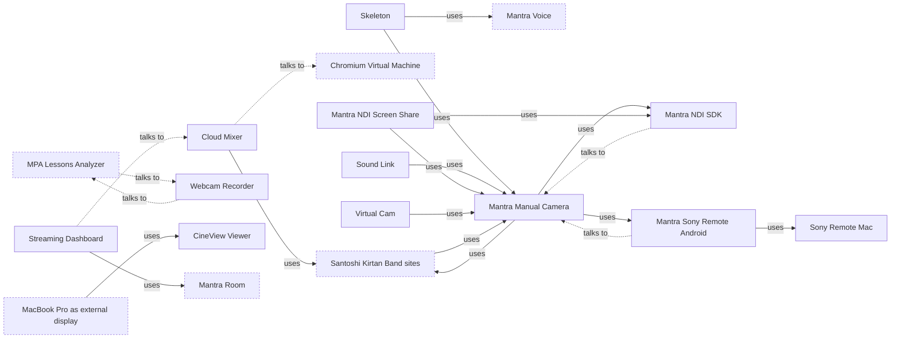
```mermaid
graph LR
  n0["Cloud Mixer"]
  n1["Santoshi Kirtan Band sites"]
  n2["Chromium Virtual Machine"]
  n3["MPA Lessons Analyzer"]
  n4["Webcam Recorder"]
  n5["MacBook Pro as external display"]
  n6["CineView Viewer"]
  n7["Skeleton"]
  n8["Mantra Voice"]
  n9["Mantra Manual Camera"]
  n10["Sound Link"]
  n11["Streaming Dashboard"]
  n12["Mantra Room"]
  n13["Mantra NDI SDK"]
  n14["Mantra Sony Remote Android"]
  n15["Mantra NDI Screen Share"]
  n16["Virtual Cam"]
  n17["Sony Remote Mac"]
  n0 -->|"uses"| n1
  n0 -.->|"talks to"| n2
  n3 -.->|"talks to"| n4
  n5 -->|"uses"| n6
  n7 -->|"uses"| n8
  n7 -->|"uses"| n9
  n10 -->|"uses"| n9
  n11 -.->|"talks to"| n0
  n11 -->|"uses"| n12
  n9 -->|"uses"| n13
  n9 -->|"uses"| n1
  n9 -->|"uses"| n14
  n15 -->|"uses"| n9
  n15 -->|"uses"| n13
  n13 -.->|"talks to"| n9
  n16 -->|"uses"| n9
  n1 -->|"uses"| n9
  n14 -->|"uses"| n17
  n14 -.->|"talks to"| n9
  n4 -.->|"talks to"| n3
  classDef stub stroke-dasharray: 3 3
  class n1,n2,n3,n5,n8,n12 stub
```

## Film and editing (DaVinci Resolve)

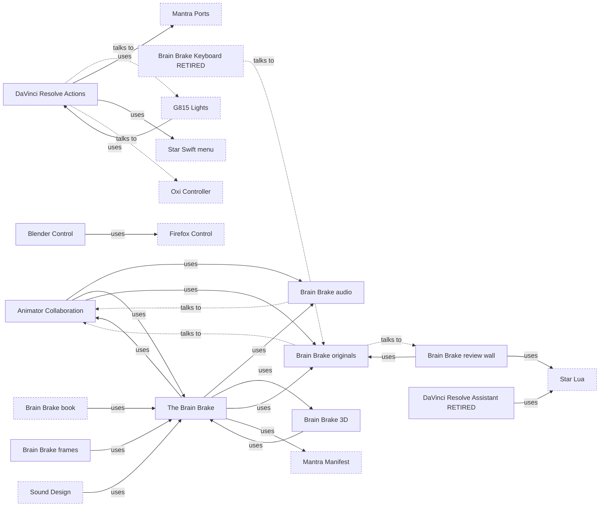
```mermaid
graph LR
  n0["Animator Collaboration"]
  n1["Brain Brake audio"]
  n2["The Brain Brake"]
  n3["Brain Brake originals"]
  n4["Brain Brake 3D"]
  n5["Mantra Manifest"]
  n6["Brain Brake book"]
  n7["Brain Brake frames"]
  n8["Brain Brake Keyboard RETIRED"]
  n9["Brain Brake review wall"]
  n10["Star Lua"]
  n11["DaVinci Resolve Actions"]
  n12["G815 Lights"]
  n13["Mantra Ports"]
  n14["Star Swift menu"]
  n15["Oxi Controller"]
  n16["DaVinci Resolve Assistant RETIRED"]
  n17["Sound Design"]
  n18["Blender Control"]
  n19["Firefox Control"]
  n0 -->|"uses"| n1
  n0 -->|"uses"| n2
  n0 -->|"uses"| n3
  n1 -.->|"talks to"| n0
  n2 -->|"uses"| n0
  n2 -->|"uses"| n1
  n2 -->|"uses"| n4
  n2 -->|"uses"| n3
  n2 -->|"uses"| n5
  n4 -->|"uses"| n2
  n6 -->|"uses"| n2
  n7 -->|"uses"| n2
  n8 -.->|"talks to"| n3
  n3 -.->|"talks to"| n0
  n3 -.->|"talks to"| n9
  n9 -->|"uses"| n3
  n9 -->|"uses"| n10
  n11 -.->|"talks to"| n12
  n11 -->|"uses"| n13
  n11 -->|"uses"| n14
  n11 -.->|"talks to"| n15
  n16 -->|"uses"| n10
  n12 -->|"uses"| n11
  n17 -->|"uses"| n2
  n18 -->|"uses"| n19
  classDef stub stroke-dasharray: 3 3
  class n5,n6,n8,n10,n12,n13,n14,n15,n17,n19 stub
```

## AI agents and Claude tooling

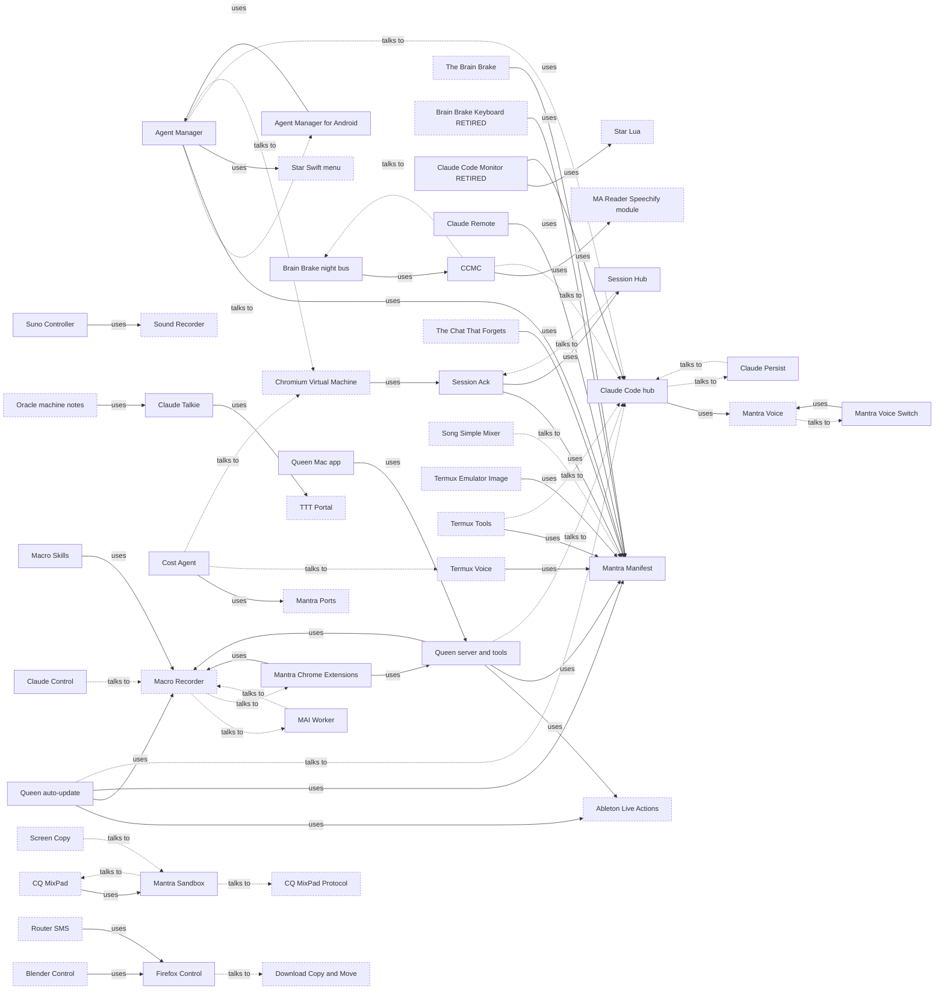
```mermaid
graph LR
  n0["Agent Manager"]
  n1["Agent Manager for Android"]
  n2["Mantra Manifest"]
  n3["Star Swift menu"]
  n4["Claude Code hub"]
  n5["Chromium Virtual Machine"]
  n6["Brain Brake night bus"]
  n7["CCMC"]
  n8["The Brain Brake"]
  n9["Brain Brake Keyboard RETIRED"]
  n10["MA Reader Speechify module"]
  n11["Suno Controller"]
  n12["Sound Recorder"]
  n13["Claude Code Monitor RETIRED"]
  n14["Star Lua"]
  n15["Claude Control"]
  n16["Macro Recorder"]
  n17["Claude Remote"]
  n18["Cost Agent"]
  n19["Mantra Ports"]
  n20["Termux Voice"]
  n21["CQ MixPad"]
  n22["Mantra Sandbox"]
  n23["Claude Talkie"]
  n24["TTT Portal"]
  n25["Queen Mac app"]
  n26["Queen server and tools"]
  n27["Macro Skills"]
  n28["MAI Worker"]
  n29["Mantra Chrome Extensions"]
  n30["CQ MixPad Protocol"]
  n31["Screen Copy"]
  n32["The Chat That Forgets"]
  n33["Mantra Voice"]
  n34["Mantra Voice Switch"]
  n35["Session Ack"]
  n36["Session Hub"]
  n37["Song Simple Mixer"]
  n38["Blender Control"]
  n39["Firefox Control"]
  n40["Claude Persist"]
  n41["Download Copy and Move"]
  n42["Queen auto-update"]
  n43["Ableton Live Actions"]
  n44["Oracle machine notes"]
  n45["Router SMS"]
  n46["Termux Emulator Image"]
  n47["Termux Tools"]
  n0 -.->|"talks to"| n1
  n0 -->|"uses"| n2
  n0 -->|"uses"| n3
  n0 -.->|"talks to"| n4
  n0 -.->|"talks to"| n5
  n1 -->|"uses"| n0
  n6 -->|"uses"| n7
  n8 -->|"uses"| n2
  n9 -->|"uses"| n2
  n7 -.->|"talks to"| n6
  n7 -->|"uses"| n10
  n7 -.->|"talks to"| n4
  n11 -->|"uses"| n12
  n13 -->|"uses"| n14
  n13 -->|"uses"| n4
  n15 -.->|"talks to"| n16
  n17 -->|"uses"| n2
  n18 -->|"uses"| n19
  n18 -.->|"talks to"| n20
  n18 -.->|"talks to"| n5
  n21 -->|"uses"| n22
  n23 -->|"uses"| n24
  n25 -->|"uses"| n26
  n27 -->|"uses"| n16
  n28 -.->|"talks to"| n16
  n29 -->|"uses"| n16
  n29 -->|"uses"| n26
  n16 -.->|"talks to"| n28
  n16 -.->|"talks to"| n29
  n22 -.->|"talks to"| n21
  n22 -.->|"talks to"| n30
  n31 -.->|"talks to"| n22
  n32 -->|"uses"| n2
  n33 -.->|"talks to"| n34
  n34 -->|"uses"| n33
  n35 -->|"uses"| n2
  n35 -->|"uses"| n36
  n36 -.->|"talks to"| n35
  n37 -.->|"talks to"| n2
  n20 -->|"uses"| n2
  n38 -->|"uses"| n39
  n4 -->|"uses"| n33
  n4 -.->|"talks to"| n40
  n40 -.->|"talks to"| n4
  n39 -.->|"talks to"| n41
  n42 -->|"uses"| n43
  n42 -->|"uses"| n16
  n42 -->|"uses"| n2
  n42 -.->|"talks to"| n4
  n26 -->|"uses"| n43
  n26 -->|"uses"| n16
  n26 -->|"uses"| n2
  n26 -.->|"talks to"| n4
  n44 -->|"uses"| n23
  n45 -->|"uses"| n39
  n46 -->|"uses"| n2
  n47 -->|"uses"| n2
  n47 -.->|"talks to"| n4
  n5 -->|"uses"| n35
  classDef stub stroke-dasharray: 3 3
  class n3,n5,n8,n9,n10,n12,n14,n16,n19,n20,n21,n24,n30,n31,n32,n33,n37,n38,n41,n43,n44,n45,n46,n47 stub
```

## Mac system utilities

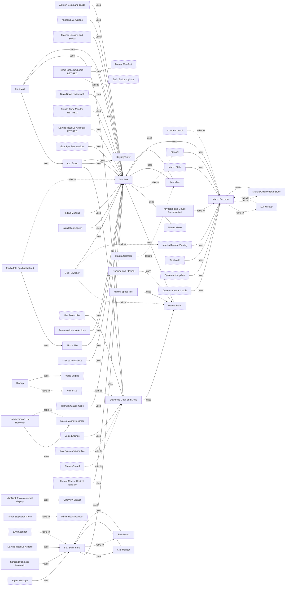
```mermaid
graph LR
  n0["Ableton Command Guide"]
  n1["Star Lua"]
  n2["Ableton Live Actions"]
  n3["Teacher Lessons and Scripts"]
  n4["Agent Manager"]
  n5["Star Swift menu"]
  n6["App Store"]
  n7["Download Copy and Move"]
  n8["KeyringTester"]
  n9["Brain Brake Keyboard RETIRED"]
  n10["Brain Brake originals"]
  n11["Mantra Manifest"]
  n12["Brain Brake review wall"]
  n13["Claude Code Monitor RETIRED"]
  n14["Claude Control"]
  n15["Macro Recorder"]
  n16["Screen Brightness Automatic"]
  n17["DaVinci Resolve Actions"]
  n18["DaVinci Resolve Assistant RETIRED"]
  n19["djay Sync Mac window"]
  n20["Mantra Ports"]
  n21["Find a File"]
  n22["Free Mac"]
  n23["Hammerspoon Lua Recorder"]
  n24["Marco Macro Recorder"]
  n25["Indian Mantras"]
  n26["Installation Logger"]
  n27["LAN Scanner"]
  n28["Dock Switcher"]
  n29["Mantra Remote Viewing"]
  n30["Macro Skills"]
  n31["Mac Transcriber"]
  n32["MAI Worker"]
  n33["Mantra Chrome Extensions"]
  n34["Mantra Controls"]
  n35["Launcher"]
  n36["Keyboard and Mouse Router retired"]
  n37["Automated Mouse Actions"]
  n38["Mantra Voice"]
  n39["Star API"]
  n40["Vox to Txt"]
  n41["MIDI to Key Stroke"]
  n42["MacBook Pro as external display"]
  n43["CineView Viewer"]
  n44["Opening and Closing"]
  n45["Mantra Speed Test"]
  n46["Star Monitor"]
  n47["Swift Matrix"]
  n48["Startup"]
  n49["Voice Engine"]
  n50["Talk Mode"]
  n51["Talk with Claude Code"]
  n52["Timer Stopwatch Clock"]
  n53["Minimalist Stopwatch"]
  n54["Voice Engines"]
  n55["djay Sync command line"]
  n56["Firefox Control"]
  n57["Queen auto-update"]
  n58["Queen server and tools"]
  n59["Mantra Mackie Control Translator"]
  n60["Find a File Spotlight retired"]
  n0 -->|"uses"| n1
  n2 -->|"uses"| n1
  n3 -->|"uses"| n1
  n4 -->|"uses"| n5
  n6 -->|"uses"| n7
  n6 -->|"uses"| n8
  n6 -->|"uses"| n1
  n9 -.->|"talks to"| n10
  n9 -->|"uses"| n11
  n9 -->|"uses"| n1
  n12 -->|"uses"| n1
  n13 -->|"uses"| n1
  n14 -.->|"talks to"| n15
  n16 -->|"uses"| n5
  n17 -->|"uses"| n5
  n18 -->|"uses"| n1
  n19 -->|"uses"| n1
  n7 -->|"uses"| n20
  n21 -->|"uses"| n1
  n22 -->|"uses"| n6
  n22 -->|"uses"| n7
  n22 -->|"uses"| n1
  n23 -->|"uses"| n24
  n25 -->|"uses"| n1
  n26 -->|"uses"| n1
  n27 -.->|"talks to"| n5
  n28 -.->|"talks to"| n20
  n28 -.->|"talks to"| n29
  n28 -->|"uses"| n1
  n30 -->|"uses"| n15
  n31 -->|"uses"| n7
  n32 -.->|"talks to"| n15
  n33 -->|"uses"| n15
  n34 -.->|"talks to"| n35
  n36 -.->|"talks to"| n15
  n15 -.->|"talks to"| n32
  n15 -.->|"talks to"| n33
  n15 -->|"uses"| n1
  n37 -->|"uses"| n1
  n29 -->|"uses"| n15
  n1 -->|"uses"| n20
  n1 -->|"uses"| n38
  n1 -.->|"talks to"| n39
  n1 -->|"uses"| n35
  n40 -.->|"talks to"| n7
  n24 -.->|"talks to"| n23
  n41 -->|"uses"| n1
  n42 -->|"uses"| n43
  n44 -->|"uses"| n20
  n45 -->|"uses"| n20
  n39 -->|"uses"| n15
  n35 -->|"uses"| n1
  n46 -->|"uses"| n5
  n5 -->|"uses"| n1
  n5 -->|"uses"| n46
  n5 -.->|"talks to"| n47
  n47 -->|"uses"| n5
  n48 -.->|"talks to"| n40
  n48 -->|"uses"| n49
  n50 -->|"uses"| n15
  n51 -->|"uses"| n1
  n52 -.->|"talks to"| n53
  n54 -->|"uses"| n7
  n55 -.->|"talks to"| n7
  n56 -.->|"talks to"| n7
  n57 -->|"uses"| n15
  n58 -->|"uses"| n15
  n59 -->|"uses"| n1
  n60 -->|"uses"| n21
  n60 -.->|"talks to"| n1
  classDef stub stroke-dasharray: 3 3
  class n0,n2,n3,n4,n8,n10,n11,n12,n13,n14,n17,n18,n19,n20,n25,n27,n29,n30,n31,n32,n33,n34,n38,n39,n40,n41,n43,n49,n50,n51,n53,n54,n55,n56,n57,n58,n59 stub
```

## Android and Termux

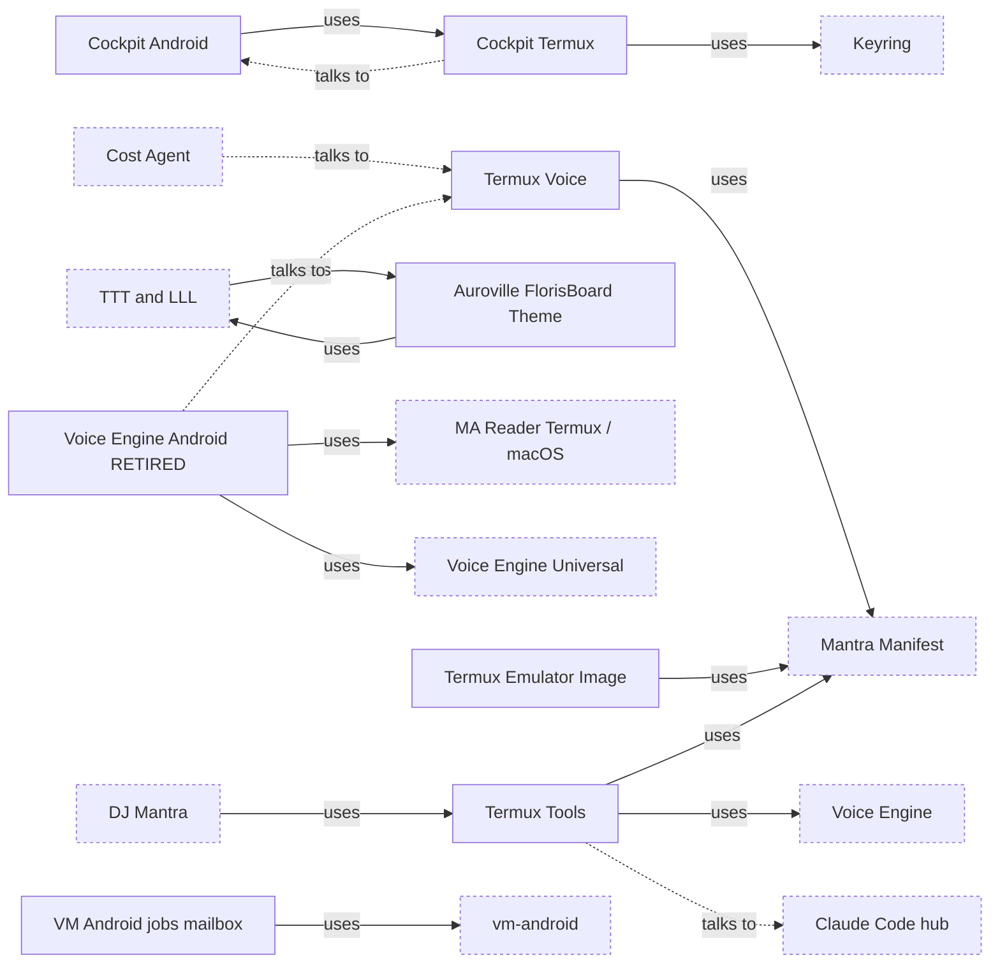
```mermaid
graph LR
  n0["Cockpit Android"]
  n1["Cockpit Termux"]
  n2["Keyring"]
  n3["Cost Agent"]
  n4["Termux Voice"]
  n5["TTT and LLL"]
  n6["Auroville FlorisBoard Theme"]
  n7["Mantra Manifest"]
  n8["Voice Engine Android RETIRED"]
  n9["MA Reader Termux / macOS"]
  n10["Voice Engine Universal"]
  n11["DJ Mantra"]
  n12["Termux Tools"]
  n13["Termux Emulator Image"]
  n14["Voice Engine"]
  n15["Claude Code hub"]
  n16["VM Android jobs mailbox"]
  n17["vm-android"]
  n0 -->|"uses"| n1
  n1 -.->|"talks to"| n0
  n1 -->|"uses"| n2
  n3 -.->|"talks to"| n4
  n5 -->|"uses"| n6
  n4 -->|"uses"| n7
  n8 -->|"uses"| n9
  n8 -.->|"talks to"| n4
  n8 -->|"uses"| n10
  n6 -->|"uses"| n5
  n11 -->|"uses"| n12
  n13 -->|"uses"| n7
  n12 -->|"uses"| n7
  n12 -->|"uses"| n14
  n12 -.->|"talks to"| n15
  n16 -->|"uses"| n17
  classDef stub stroke-dasharray: 3 3
  class n2,n3,n5,n7,n9,n10,n11,n14,n15,n17 stub
```

## Remote control and networking

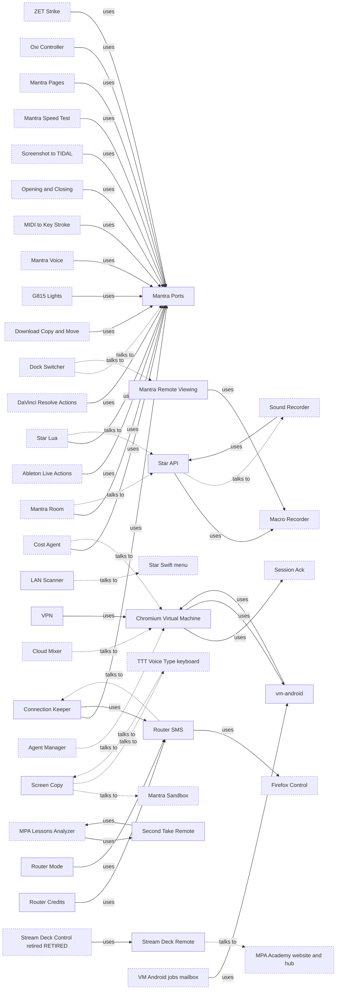
```mermaid
graph LR
  n0["Ableton Live Actions"]
  n1["Mantra Ports"]
  n2["Agent Manager"]
  n3["Chromium Virtual Machine"]
  n4["Cloud Mixer"]
  n5["Cost Agent"]
  n6["DaVinci Resolve Actions"]
  n7["Download Copy and Move"]
  n8["G815 Lights"]
  n9["LAN Scanner"]
  n10["Star Swift menu"]
  n11["Dock Switcher"]
  n12["Mantra Remote Viewing"]
  n13["Macro Recorder"]
  n14["Mantra Room"]
  n15["Star API"]
  n16["Screen Copy"]
  n17["Mantra Sandbox"]
  n18["TTT Voice Type keyboard"]
  n19["Sound Recorder"]
  n20["Star Lua"]
  n21["Mantra Voice"]
  n22["VPN"]
  n23["MIDI to Key Stroke"]
  n24["MPA Lessons Analyzer"]
  n25["Second Take Remote"]
  n26["Opening and Closing"]
  n27["Screenshot to TIDAL"]
  n28["Mantra Speed Test"]
  n29["Stream Deck Remote"]
  n30["MPA Academy website and hub"]
  n31["Connection Keeper"]
  n32["Router SMS"]
  n33["Mantra Pages"]
  n34["Oxi Controller"]
  n35["Router Credits"]
  n36["Router Mode"]
  n37["Firefox Control"]
  n38["Stream Deck Control retired RETIRED"]
  n39["vm-android"]
  n40["VM Android jobs mailbox"]
  n41["Session Ack"]
  n42["ZET Strike"]
  n0 -->|"uses"| n1
  n2 -.->|"talks to"| n3
  n4 -.->|"talks to"| n3
  n5 -->|"uses"| n1
  n5 -.->|"talks to"| n3
  n6 -->|"uses"| n1
  n7 -->|"uses"| n1
  n8 -->|"uses"| n1
  n9 -.->|"talks to"| n10
  n11 -.->|"talks to"| n1
  n11 -.->|"talks to"| n12
  n12 -->|"uses"| n13
  n14 -->|"uses"| n1
  n14 -.->|"talks to"| n15
  n16 -.->|"talks to"| n17
  n16 -.->|"talks to"| n18
  n19 -->|"uses"| n15
  n20 -->|"uses"| n1
  n20 -.->|"talks to"| n15
  n21 -->|"uses"| n1
  n22 -->|"uses"| n3
  n23 -->|"uses"| n1
  n24 -->|"uses"| n25
  n26 -->|"uses"| n1
  n27 -->|"uses"| n1
  n25 -->|"uses"| n24
  n28 -->|"uses"| n1
  n15 -->|"uses"| n13
  n15 -.->|"talks to"| n19
  n29 -.->|"talks to"| n30
  n18 -.->|"talks to"| n16
  n31 -->|"uses"| n1
  n31 -->|"uses"| n32
  n33 -->|"uses"| n1
  n34 -->|"uses"| n1
  n35 -->|"uses"| n32
  n36 -->|"uses"| n32
  n32 -.->|"talks to"| n31
  n32 -->|"uses"| n37
  n38 -->|"uses"| n29
  n39 -->|"uses"| n3
  n40 -->|"uses"| n39
  n3 -->|"uses"| n41
  n3 -->|"uses"| n39
  n42 -->|"uses"| n1
  classDef stub stroke-dasharray: 3 3
  class n0,n2,n4,n5,n6,n7,n8,n10,n11,n13,n14,n17,n18,n19,n20,n21,n23,n24,n26,n27,n28,n30,n33,n34,n37,n38,n40,n41,n42 stub
```

## Lights, keyboard and visuals

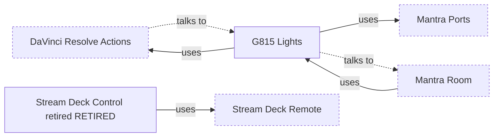
```mermaid
graph LR
  n0["DaVinci Resolve Actions"]
  n1["G815 Lights"]
  n2["Mantra Ports"]
  n3["Mantra Room"]
  n4["Stream Deck Control retired RETIRED"]
  n5["Stream Deck Remote"]
  n0 -.->|"talks to"| n1
  n1 -->|"uses"| n0
  n1 -->|"uses"| n2
  n1 -.->|"talks to"| n3
  n3 -->|"uses"| n1
  n4 -->|"uses"| n5
  classDef stub stroke-dasharray: 3 3
  class n0,n2,n3,n5 stub
```

## Wellbeing, sound and meditation

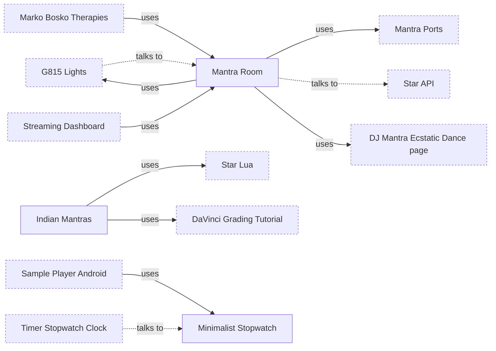
```mermaid
graph LR
  n0["G815 Lights"]
  n1["Mantra Room"]
  n2["Indian Mantras"]
  n3["Star Lua"]
  n4["DaVinci Grading Tutorial"]
  n5["Mantra Ports"]
  n6["Star API"]
  n7["DJ Mantra Ecstatic Dance page"]
  n8["Marko Bosko Therapies"]
  n9["Sample Player Android"]
  n10["Minimalist Stopwatch"]
  n11["Streaming Dashboard"]
  n12["Timer Stopwatch Clock"]
  n0 -.->|"talks to"| n1
  n2 -->|"uses"| n3
  n2 -->|"uses"| n4
  n1 -->|"uses"| n0
  n1 -->|"uses"| n5
  n1 -.->|"talks to"| n6
  n1 -->|"uses"| n7
  n8 -->|"uses"| n1
  n9 -->|"uses"| n10
  n11 -->|"uses"| n1
  n12 -.->|"talks to"| n10
  classDef stub stroke-dasharray: 3 3
  class n0,n3,n4,n5,n6,n7,n8,n9,n11,n12 stub
```

## Websites and pages

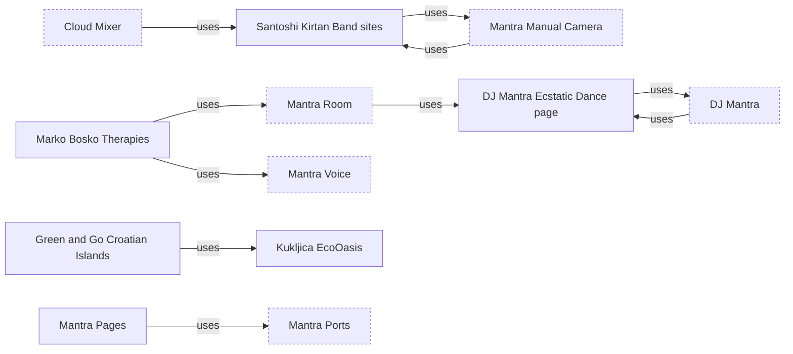
```mermaid
graph LR
  n0["Cloud Mixer"]
  n1["Santoshi Kirtan Band sites"]
  n2["Mantra Room"]
  n3["DJ Mantra Ecstatic Dance page"]
  n4["Marko Bosko Therapies"]
  n5["Mantra Voice"]
  n6["DJ Mantra"]
  n7["Green and Go Croatian Islands"]
  n8["Kukljica EcoOasis"]
  n9["Mantra Manual Camera"]
  n10["Mantra Pages"]
  n11["Mantra Ports"]
  n0 -->|"uses"| n1
  n2 -->|"uses"| n3
  n4 -->|"uses"| n2
  n4 -->|"uses"| n5
  n3 -->|"uses"| n6
  n6 -->|"uses"| n3
  n7 -->|"uses"| n8
  n9 -->|"uses"| n1
  n10 -->|"uses"| n11
  n1 -->|"uses"| n9
  classDef stub stroke-dasharray: 3 3
  class n0,n2,n5,n6,n9,n11 stub
```

## Knowledge, books and guides

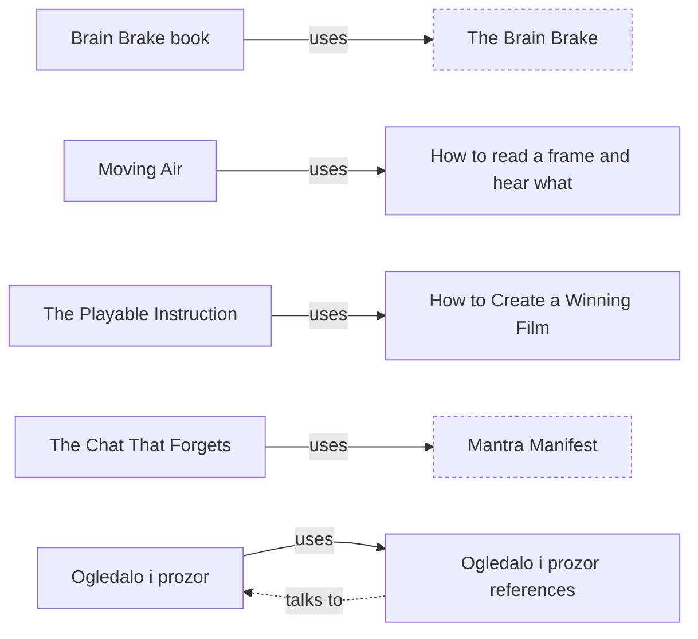
```mermaid
graph LR
  n0["Brain Brake book"]
  n1["The Brain Brake"]
  n2["Moving Air"]
  n3["How to read a frame and hear what"]
  n4["The Playable Instruction"]
  n5["How to Create a Winning Film"]
  n6["The Chat That Forgets"]
  n7["Mantra Manifest"]
  n8["Ogledalo i prozor"]
  n9["Ogledalo i prozor references"]
  n0 -->|"uses"| n1
  n2 -->|"uses"| n3
  n4 -->|"uses"| n5
  n6 -->|"uses"| n7
  n8 -->|"uses"| n9
  n9 -.->|"talks to"| n8
  classDef stub stroke-dasharray: 3 3
  class n1,n7 stub
```

## Learning and academy

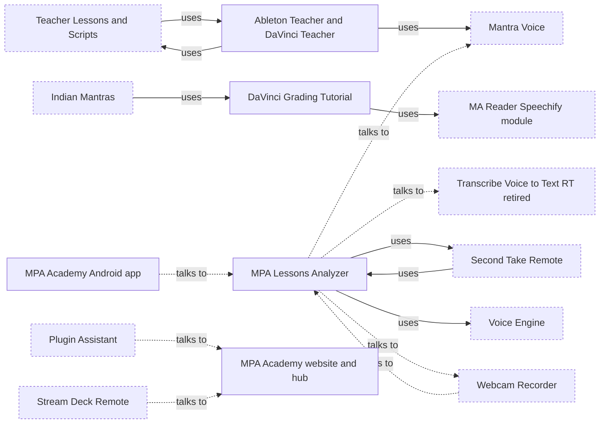
```mermaid
graph LR
  n0["Teacher Lessons and Scripts"]
  n1["Ableton Teacher and DaVinci Teacher"]
  n2["Indian Mantras"]
  n3["DaVinci Grading Tutorial"]
  n4["Mantra Voice"]
  n5["MPA Academy Android app"]
  n6["MPA Lessons Analyzer"]
  n7["Transcribe Voice to Text RT retired"]
  n8["Second Take Remote"]
  n9["Voice Engine"]
  n10["Webcam Recorder"]
  n11["Plugin Assistant"]
  n12["MPA Academy website and hub"]
  n13["MA Reader Speechify module"]
  n14["Stream Deck Remote"]
  n0 -->|"uses"| n1
  n2 -->|"uses"| n3
  n1 -->|"uses"| n0
  n1 -->|"uses"| n4
  n5 -.->|"talks to"| n6
  n6 -.->|"talks to"| n4
  n6 -.->|"talks to"| n7
  n6 -->|"uses"| n8
  n6 -->|"uses"| n9
  n6 -.->|"talks to"| n10
  n11 -.->|"talks to"| n12
  n3 -->|"uses"| n13
  n8 -->|"uses"| n6
  n14 -.->|"talks to"| n12
  n10 -.->|"talks to"| n6
  classDef stub stroke-dasharray: 3 3
  class n0,n2,n4,n7,n8,n9,n10,n11,n13,n14 stub
```

## Maps, travel and location

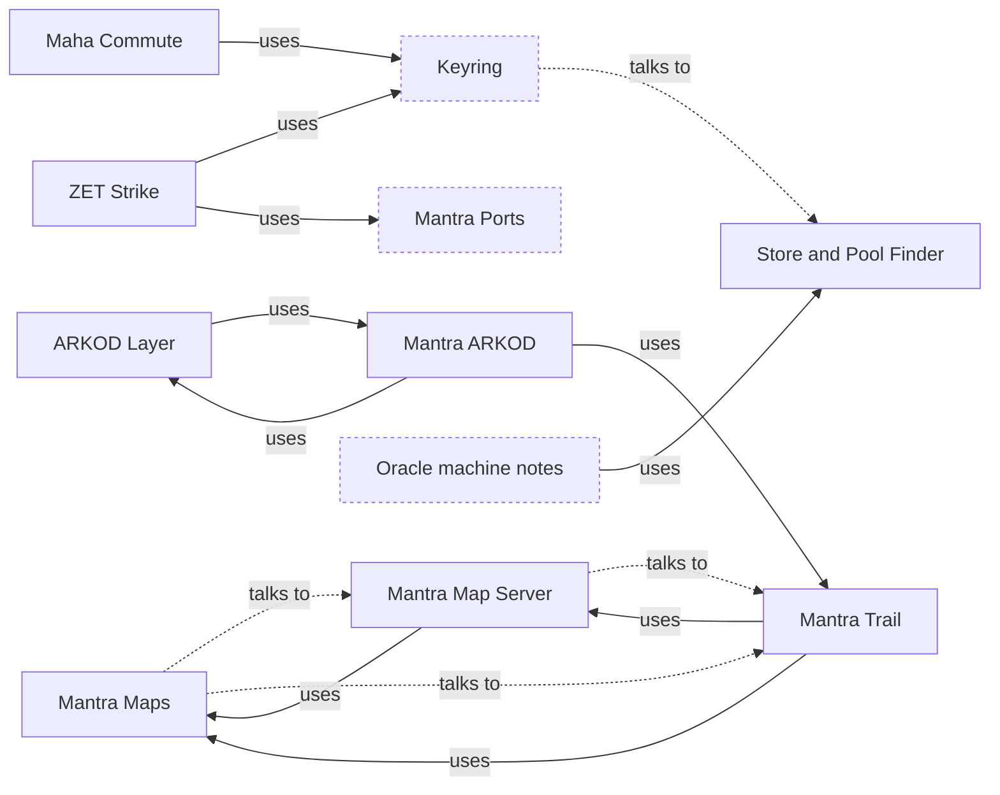
```mermaid
graph LR
  n0["Keyring"]
  n1["Store and Pool Finder"]
  n2["Maha Commute"]
  n3["Mantra Maps"]
  n4["Mantra Map Server"]
  n5["Mantra Trail"]
  n6["ARKOD Layer"]
  n7["Mantra ARKOD"]
  n8["Oracle machine notes"]
  n9["ZET Strike"]
  n10["Mantra Ports"]
  n0 -.->|"talks to"| n1
  n2 -->|"uses"| n0
  n3 -.->|"talks to"| n4
  n3 -.->|"talks to"| n5
  n4 -->|"uses"| n3
  n4 -.->|"talks to"| n5
  n5 -->|"uses"| n3
  n5 -->|"uses"| n4
  n6 -->|"uses"| n7
  n7 -->|"uses"| n5
  n7 -->|"uses"| n6
  n8 -->|"uses"| n1
  n9 -->|"uses"| n0
  n9 -->|"uses"| n10
  classDef stub stroke-dasharray: 3 3
  class n0,n8,n10 stub
```

## Keys, secrets and infrastructure

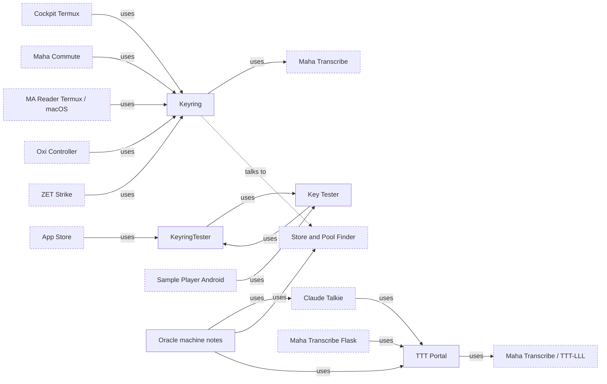
```mermaid
graph LR
  n0["App Store"]
  n1["KeyringTester"]
  n2["Cockpit Termux"]
  n3["Keyring"]
  n4["Claude Talkie"]
  n5["TTT Portal"]
  n6["Maha Transcribe"]
  n7["Store and Pool Finder"]
  n8["Key Tester"]
  n9["Maha Commute"]
  n10["Maha Transcribe Flask"]
  n11["MA Reader Termux / macOS"]
  n12["Sample Player Android"]
  n13["Maha Transcribe / TTT-LLL"]
  n14["Oracle machine notes"]
  n15["Oxi Controller"]
  n16["ZET Strike"]
  n0 -->|"uses"| n1
  n2 -->|"uses"| n3
  n4 -->|"uses"| n5
  n3 -->|"uses"| n6
  n3 -.->|"talks to"| n7
  n1 -->|"uses"| n8
  n8 -->|"uses"| n1
  n9 -->|"uses"| n3
  n10 -->|"uses"| n5
  n11 -->|"uses"| n3
  n12 -->|"uses"| n8
  n5 -->|"uses"| n13
  n14 -->|"uses"| n4
  n14 -->|"uses"| n7
  n14 -->|"uses"| n5
  n15 -->|"uses"| n3
  n16 -->|"uses"| n3
  classDef stub stroke-dasharray: 3 3
  class n0,n2,n4,n6,n7,n9,n10,n11,n12,n13,n15,n16 stub
```

## Planned: Light Control (Mantra)

Light Control (Mantra) is planned, not built (kickoff prompt: [prompts/LIGHT_CONTROL.md](prompts/LIGHT_CONTROL.md)). Arrows show who calls whom; labels give the role and the port.

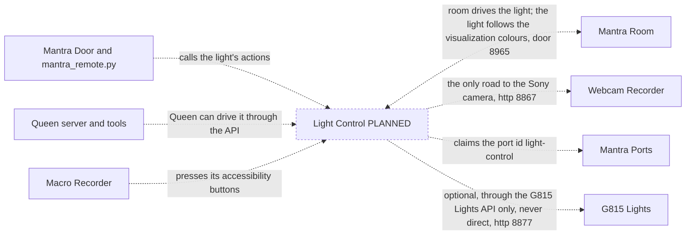
```mermaid
graph LR
  n0["Light Control PLANNED"]
  n1["Mantra Room"]
  n2["Webcam Recorder"]
  n3["Mantra Ports"]
  n4["Mantra Door and mantra_remote.py"]
  n5["Queen server and tools"]
  n6["Macro Recorder"]
  n7["G815 Lights"]
  n0 <-.->|"room drives the light; the light follows the visualization colours, door 8965"| n1
  n0 -.->|"the only road to the Sony camera, http 8867"| n2
  n0 -.->|"claims the port id light-control"| n3
  n4 -.->|"calls the light's actions"| n0
  n5 -.->|"Queen can drive it through the API"| n0
  n6 -.->|"presses its accessibility buttons"| n0
  n0 -.->|"optional, through the G815 Lights API only, never direct, http 8877"| n7
  classDef stub stroke-dasharray: 3 3
  class n0 stub
```

- <-> [Mantra Room (Meditation Room / Chakra and Elements Toning) (MANTRA_ROOM)](apps/MANTRA_ROOM.md) [door 8965]: room drives the light; the light follows the visualization colours
- -> [Webcam Recorder (Mantra) (web-cam-viewer)](apps/web-cam-viewer.md) [http 8867]: the only road to the Sony camera
- -> [Mantra Ports (MANTRA_PORTS)](apps/MANTRA_PORTS.md): claims the port id light-control
- <- Mantra Door and mantra_remote.py (not a repo on this map): calls the light's actions
- <- [Queen (Groq AI Studio), server and tools (groq_ai_studio)](apps/groq_ai_studio.md): Queen can drive it through the API
- <- [Macro Recorder (Mantra) (MANTRA_MACRO)](apps/MANTRA_MACRO.md): presses its accessibility buttons
- -> [G815 Lights (G815_LIGHTS)](apps/G815_LIGHTS.md) [http 8877]: optional, through the G815 Lights API only, never direct

## Edge list

Format: app -> what it uses (u) or talks to (t).

- [222 Transcribe (222-transcribe)](apps/222-transcribe.md) -> [111 Transcribe (111-transcribe)](apps/111-transcribe.md) (u)
- [Ableton Command Guide (ABLETON_COMMAND_GUIDE)](apps/ABLETON_COMMAND_GUIDE.md) -> [Teacher Lessons and Scripts (Ableton, DaVinci) (ABLETON_TEACHER)](apps/ABLETON_TEACHER.md) (u), [Star (Mantra), Lua (Hammerspoon, legacy) (MANTRA_STAR)](apps/MANTRA_STAR.md) (u), [Mantra Voice (speech server) (MANTRA_VOICE)](apps/MANTRA_VOICE.md) (u)
- [Ableton Live Actions (Mantra) (ABLETON_LIVE_ACTIONS)](apps/ABLETON_LIVE_ACTIONS.md) -> [CQ MixPad (Mantra) (CQ_MIXPAD_MANTRA)](apps/CQ_MIXPAD_MANTRA.md) (t), [Mantra Ports (MANTRA_PORTS)](apps/MANTRA_PORTS.md) (u), [Star (Mantra), Lua (Hammerspoon, legacy) (MANTRA_STAR)](apps/MANTRA_STAR.md) (u)
- [Ableton Teacher and DaVinci Teacher apps (Mantra) (MANTRA_TEACHERS)](apps/MANTRA_TEACHERS.md) -> [Teacher Lessons and Scripts (Ableton, DaVinci) (ABLETON_TEACHER)](apps/ABLETON_TEACHER.md) (u), [Mantra Voice (speech server) (MANTRA_VOICE)](apps/MANTRA_VOICE.md) (u)
- [Agent Manager (CEO) (Mantra) (AGENT_MANAGER)](apps/AGENT_MANAGER.md) -> [Agent Manager (CEO) (Mantra) for Android (AGENT_MANAGER_ANDROID)](apps/AGENT_MANAGER_ANDROID.md) (t), [Mantra Manifest (MANTRA_MANIFEST)](apps/MANTRA_MANIFEST.md) (u), [Star (Mantra), Swift menu (STAR_SWIFT)](apps/STAR_SWIFT.md) (u), [Claude Code hub (claude-code)](apps/claude-code.md) (t), [Chromium Virtual Machine (Mantra) (vm-chromium)](apps/vm-chromium.md) (t)
- [Agent Manager (CEO) (Mantra) for Android (AGENT_MANAGER_ANDROID)](apps/AGENT_MANAGER_ANDROID.md) -> [Agent Manager (CEO) (Mantra) (AGENT_MANAGER)](apps/AGENT_MANAGER.md) (u)
- [Animator Collaboration (ANIMATOR_COLLABORATION)](apps/ANIMATOR_COLLABORATION.md) -> [Brain Brake audio (BRAINBREAK_AUDIO)](apps/BRAINBREAK_AUDIO.md) (u), [The Brain Brake (film repository) (BRAIN_BRAKE)](apps/BRAIN_BRAKE.md) (u), [Brain Brake originals (BRAIN_BRAKE_ORIGINALS)](apps/BRAIN_BRAKE_ORIGINALS.md) (u)
- [App Store (Mantra) (APP_STORE)](apps/APP_STORE.md) -> [Download, Copy and Move (Mantra) (was Download Monitor) (DOWNLOAD_MONITOR)](apps/DOWNLOAD_MONITOR.md) (u), [KeyringTester (Mantra) (KEY_RING_TESTER)](apps/KEY_RING_TESTER.md) (u), [Star (Mantra), Lua (Hammerspoon, legacy) (MANTRA_STAR)](apps/MANTRA_STAR.md) (u)
- [ARKOD Layer (web) (arkod_web)](apps/arkod_web.md) -> [Mantra ARKOD (mantra_arkod)](apps/mantra_arkod.md) (u)
- [Auroville FlorisBoard Theme (auroville-florisboard-theme)](apps/auroville-florisboard-theme.md) -> [TTT&LLL (Talk to Type, Look Listen Learn) (DictateKeyboard)](apps/DictateKeyboard.md) (u)
- [Automated Mouse Actions (Mantra) (MANTRA_MOUSE)](apps/MANTRA_MOUSE.md) -> [Star (Mantra), Lua (Hammerspoon, legacy) (MANTRA_STAR)](apps/MANTRA_STAR.md) (u)
- [Blender Control (blender-control)](apps/blender-control.md) -> [Firefox Control (firefox-control)](apps/firefox-control.md) (u)
- [Brain Brake 3D (BRAIN_BRAKE_3D)](apps/BRAIN_BRAKE_3D.md) -> [The Brain Brake (film repository) (BRAIN_BRAKE)](apps/BRAIN_BRAKE.md) (u)
- [Brain Brake audio (BRAINBREAK_AUDIO)](apps/BRAINBREAK_AUDIO.md) -> [Animator Collaboration (ANIMATOR_COLLABORATION)](apps/ANIMATOR_COLLABORATION.md) (t)
- [Brain Brake book (BRAIN_BRAKE_BOOK)](apps/BRAIN_BRAKE_BOOK.md) -> [The Brain Brake (film repository) (BRAIN_BRAKE)](apps/BRAIN_BRAKE.md) (u)
- [Brain Brake frames (BRAIN_BRAKE_FRAMES)](apps/BRAIN_BRAKE_FRAMES.md) -> [The Brain Brake (film repository) (BRAIN_BRAKE)](apps/BRAIN_BRAKE.md) (u)
- [Brain Brake Keyboard (Hammerspoon) (BRAIN_BRAKE_KEYBOARD) (retired)](apps/BRAIN_BRAKE_KEYBOARD.md) -> [Brain Brake originals (BRAIN_BRAKE_ORIGINALS)](apps/BRAIN_BRAKE_ORIGINALS.md) (t), [Mantra Manifest (MANTRA_MANIFEST)](apps/MANTRA_MANIFEST.md) (u), [Star (Mantra), Lua (Hammerspoon, legacy) (MANTRA_STAR)](apps/MANTRA_STAR.md) (u)
- [Brain Brake night bus (BRAINBREAK_BUS)](apps/BRAINBREAK_BUS.md) -> [CCMC (MANTRA CHAT, the sister of Claude Code) (CCMC)](apps/CCMC.md) (u)
- [Brain Brake originals (BRAIN_BRAKE_ORIGINALS)](apps/BRAIN_BRAKE_ORIGINALS.md) -> [Animator Collaboration (ANIMATOR_COLLABORATION)](apps/ANIMATOR_COLLABORATION.md) (t), [Brain Brake review wall (BRAIN_BRAKE_REVIEW)](apps/BRAIN_BRAKE_REVIEW.md) (t)
- [Brain Brake review wall (BRAIN_BRAKE_REVIEW)](apps/BRAIN_BRAKE_REVIEW.md) -> [Brain Brake originals (BRAIN_BRAKE_ORIGINALS)](apps/BRAIN_BRAKE_ORIGINALS.md) (u), [Star (Mantra), Lua (Hammerspoon, legacy) (MANTRA_STAR)](apps/MANTRA_STAR.md) (u)
- [CCMC (MANTRA CHAT, the sister of Claude Code) (CCMC)](apps/CCMC.md) -> [Brain Brake night bus (BRAINBREAK_BUS)](apps/BRAINBREAK_BUS.md) (t), [MA Reader Speechify module (MA_READER_SPEECHIFY)](apps/MA_READER_SPEECHIFY.md) (u), [Claude Code hub (claude-code)](apps/claude-code.md) (t)
- [Chromium Virtual Machine (Mantra) (vm-chromium)](apps/vm-chromium.md) -> [Session Ack (ccmsg) (SESSION_ACK)](apps/SESSION_ACK.md) (u), [vm-android (Pixel 7 in Oracle Cloud) (vm-android)](apps/vm-android.md) (u)
- [Claude Code hub (claude-code)](apps/claude-code.md) -> [Mantra Voice (speech server) (MANTRA_VOICE)](apps/MANTRA_VOICE.md) (u), [Claude Persist (claude-persist)](apps/claude-persist.md) (t)
- [Claude Code Monitor (Mantra) (CLAUDE_CODE_MONITOR) (retired)](apps/CLAUDE_CODE_MONITOR.md) -> [Star (Mantra), Lua (Hammerspoon, legacy) (MANTRA_STAR)](apps/MANTRA_STAR.md) (u), [Claude Code hub (claude-code)](apps/claude-code.md) (u)
- [Claude Control (Mantra) (CLAUDE_CONTROL)](apps/CLAUDE_CONTROL.md) -> [Macro Recorder (Mantra) (MANTRA_MACRO)](apps/MANTRA_MACRO.md) (t)
- [Claude Persist (claude-persist)](apps/claude-persist.md) -> [Claude Code hub (claude-code)](apps/claude-code.md) (t)
- [Claude Remote (Mantra) (CLAUDE_REMOTE)](apps/CLAUDE_REMOTE.md) -> [Mantra Manifest (MANTRA_MANIFEST)](apps/MANTRA_MANIFEST.md) (u)
- [Claude Talkie (Claude_Toki)](apps/Claude_Toki.md) -> [TTT Portal (TTT_PORTAL)](apps/TTT_PORTAL.md) (u)
- [Cloud Mixer (CLOUD_MIXER)](apps/CLOUD_MIXER.md) -> [Santoshi Kirtan Band sites (santoshi_band_site)](apps/santoshi_band_site.md) (u), [Chromium Virtual Machine (Mantra) (vm-chromium)](apps/vm-chromium.md) (t)
- [Cockpit Android (COCKPIT_ANDROID)](apps/COCKPIT_ANDROID.md) -> [Cockpit Termux (COCKPIT_TERMUX)](apps/COCKPIT_TERMUX.md) (u)
- [Cockpit Termux (COCKPIT_TERMUX)](apps/COCKPIT_TERMUX.md) -> [Cockpit Android (COCKPIT_ANDROID)](apps/COCKPIT_ANDROID.md) (t), [Keyring (KEYRING_TERMUX)](apps/KEYRING_TERMUX.md) (u)
- [Connection Keeper (connection-keeper)](apps/connection-keeper.md) -> [Mantra Ports (MANTRA_PORTS)](apps/MANTRA_PORTS.md) (u), [Router SMS (router-sms)](apps/router-sms.md) (u)
- [Controller Mapper (Mantra) (mix-ultra-mapper)](apps/mix-ultra-mapper.md) -> [DJ Mantra (Android DJ app) (djmantra_app)](apps/djmantra_app.md) (u)
- [Cost Agent (Mantra) (COST_AGENT)](apps/COST_AGENT.md) -> [Mantra Ports (MANTRA_PORTS)](apps/MANTRA_PORTS.md) (u), [Termux Voice (voiced) (TERMUX_VOICE)](apps/TERMUX_VOICE.md) (t), [Chromium Virtual Machine (Mantra) (vm-chromium)](apps/vm-chromium.md) (t)
- [CQ Ethernet Bridge (CQ_ETHERNET_BRIDGE)](apps/CQ_ETHERNET_BRIDGE.md) -> [CQ MixPad (Mantra) (CQ_MIXPAD_MANTRA)](apps/CQ_MIXPAD_MANTRA.md) (t)
- [CQ MixPad (Mantra) (CQ_MIXPAD_MANTRA)](apps/CQ_MIXPAD_MANTRA.md) -> [Ableton Live Actions (Mantra) (ABLETON_LIVE_ACTIONS)](apps/ABLETON_LIVE_ACTIONS.md) (t), [Mantra Sandbox (MANTRA_SANDBOX)](apps/MANTRA_SANDBOX.md) (u), [CQ MixPad Protocol (cq_mixpad_protocol)](apps/cq_mixpad_protocol.md) (u)
- [CQ MixPad Protocol (cq_mixpad_protocol)](apps/cq_mixpad_protocol.md) -> [CQ MixPad (Mantra) (CQ_MIXPAD_MANTRA)](apps/CQ_MIXPAD_MANTRA.md) (t), [CQ MixPad Tutorial (Mantra) (cq_mixpad_tutorial)](apps/cq_mixpad_tutorial.md) (t)
- [CQ MixPad Tutorial (Mantra) (cq_mixpad_tutorial)](apps/cq_mixpad_tutorial.md) -> [CQ MixPad (Mantra) (CQ_MIXPAD_MANTRA)](apps/CQ_MIXPAD_MANTRA.md) (t), [Mantra Voice (speech server) (MANTRA_VOICE)](apps/MANTRA_VOICE.md) (u)
- [DaVinci Grading Tutorial (Mantra) (RESOLVE_GRADING_TUTORIAL)](apps/RESOLVE_GRADING_TUTORIAL.md) -> [MA Reader Speechify module (MA_READER_SPEECHIFY)](apps/MA_READER_SPEECHIFY.md) (u)
- [DaVinci Resolve Actions (Mantra) (DAVINCI_RESOLVE_ACTIONS)](apps/DAVINCI_RESOLVE_ACTIONS.md) -> [G815 Lights (G815_LIGHTS)](apps/G815_LIGHTS.md) (t), [Mantra Ports (MANTRA_PORTS)](apps/MANTRA_PORTS.md) (u), [Star (Mantra), Swift menu (STAR_SWIFT)](apps/STAR_SWIFT.md) (u), [Oxi Controller (E16 Remote) (oxi-controller)](apps/oxi-controller.md) (t)
- [DaVinci Resolve Assistant (DAVINCI_RESOLVE_ASSISTANT) (retired, use DAVINCI_RESOLVE_ACTIONS)](apps/DAVINCI_RESOLVE_ASSISTANT.md) -> [Star (Mantra), Lua (Hammerspoon, legacy) (MANTRA_STAR)](apps/MANTRA_STAR.md) (u)
- [DJ Mantra (Android DJ app) (djmantra_app)](apps/djmantra_app.md) -> [DJ Mantra Ecstatic Dance page (djmantra-ecstatic-dance)](apps/djmantra-ecstatic-dance.md) (u), [Termux Tools (termux-tools)](apps/termux-tools.md) (u)
- [DJ Mantra Ecstatic Dance page (djmantra-ecstatic-dance)](apps/djmantra-ecstatic-dance.md) -> [DJ Mantra (Android DJ app) (djmantra_app)](apps/djmantra_app.md) (u)
- [DJ Transfer Monitor (Mantra) (DJ_TRANSFER_MONITOR)](apps/DJ_TRANSFER_MONITOR.md) -> [djay Sync (Mantra), Mac window (DJING_SYNC)](apps/DJING_SYNC.md) (u), [djay Sync, command line (djay-sync) (djay-playlists)](apps/djay-playlists.md) (u)
- [djay Sync (Mantra), Mac window (DJING_SYNC)](apps/DJING_SYNC.md) -> [DJ Transfer Monitor (Mantra) (DJ_TRANSFER_MONITOR)](apps/DJ_TRANSFER_MONITOR.md) (t), [Star (Mantra), Lua (Hammerspoon, legacy) (MANTRA_STAR)](apps/MANTRA_STAR.md) (u), [djay Sync, command line (djay-sync) (djay-playlists)](apps/djay-playlists.md) (u)
- [djay Sync, command line (djay-sync) (djay-playlists)](apps/djay-playlists.md) -> [djay Sync (Mantra), Mac window (DJING_SYNC)](apps/DJING_SYNC.md) (u), [DJ Transfer Monitor (Mantra) (DJ_TRANSFER_MONITOR)](apps/DJ_TRANSFER_MONITOR.md) (t), [Download, Copy and Move (Mantra) (was Download Monitor) (DOWNLOAD_MONITOR)](apps/DOWNLOAD_MONITOR.md) (t)
- [Dock Switcher (Mantra) (MACOS_TASK_SWITCHER)](apps/MACOS_TASK_SWITCHER.md) -> [Mantra Ports (MANTRA_PORTS)](apps/MANTRA_PORTS.md) (t), [Mantra Remote Viewing (Mantra Remote) (MANTRA_REMOTE_VIEWING)](apps/MANTRA_REMOTE_VIEWING.md) (t), [Star (Mantra), Lua (Hammerspoon, legacy) (MANTRA_STAR)](apps/MANTRA_STAR.md) (u)
- [Download, Copy and Move (Mantra) (was Download Monitor) (DOWNLOAD_MONITOR)](apps/DOWNLOAD_MONITOR.md) -> [Mantra Ports (MANTRA_PORTS)](apps/MANTRA_PORTS.md) (u)
- [Find a File (Mantra) (FIND_FILE)](apps/FIND_FILE.md) -> [Star (Mantra), Lua (Hammerspoon, legacy) (MANTRA_STAR)](apps/MANTRA_STAR.md) (u)
- [Find a File Spotlight (Mantra), retired (spotlight) (retired, use FIND_FILE)](apps/spotlight.md) -> [Find a File (Mantra) (FIND_FILE)](apps/FIND_FILE.md) (u), [Star (Mantra), Lua (Hammerspoon, legacy) (MANTRA_STAR)](apps/MANTRA_STAR.md) (t)
- [Firefox Control (firefox-control)](apps/firefox-control.md) -> [Download, Copy and Move (Mantra) (was Download Monitor) (DOWNLOAD_MONITOR)](apps/DOWNLOAD_MONITOR.md) (t)
- [Free Mac (FREE_MAC)](apps/FREE_MAC.md) -> [App Store (Mantra) (APP_STORE)](apps/APP_STORE.md) (u), [Download, Copy and Move (Mantra) (was Download Monitor) (DOWNLOAD_MONITOR)](apps/DOWNLOAD_MONITOR.md) (u), [Star (Mantra), Lua (Hammerspoon, legacy) (MANTRA_STAR)](apps/MANTRA_STAR.md) (u)
- [G815 Lights (G815_LIGHTS)](apps/G815_LIGHTS.md) -> [DaVinci Resolve Actions (Mantra) (DAVINCI_RESOLVE_ACTIONS)](apps/DAVINCI_RESOLVE_ACTIONS.md) (u), [Mantra Ports (MANTRA_PORTS)](apps/MANTRA_PORTS.md) (u), [Mantra Room (Meditation Room / Chakra and Elements Toning) (MANTRA_ROOM)](apps/MANTRA_ROOM.md) (t)
- [Generated Playlists (generated_playlists)](apps/generated_playlists.md) -> [Screenshot to TIDAL (Mantra) (SCREENSHOT_TO_TIDAL)](apps/SCREENSHOT_TO_TIDAL.md) (u), [DJ Mantra (Android DJ app) (djmantra_app)](apps/djmantra_app.md) (u)
- [Google TTS and STT (gtt) (GOOGLE_TTS_STT)](apps/GOOGLE_TTS_STT.md) -> [GVoices (Google Voices) (GoogleVoices)](apps/GoogleVoices.md) (t)
- [Green and Go Croatian Islands (green-and-go-croatian-islands)](apps/green-and-go-croatian-islands.md) -> [Kukljica EcoOasis (KUKLJICA_ECOOASIS)](apps/KUKLJICA_ECOOASIS.md) (u)
- [Hammerspoon Lua Recorder (HAMMERSPOON_LUA_RECORDER)](apps/HAMMERSPOON_LUA_RECORDER.md) -> [Marco Macro Recorder (Windows) (MARCO_MACRO_RECORDER)](apps/MARCO_MACRO_RECORDER.md) (u)
- [Indian Mantras (Mantra) (INDIAN_MANTRAS)](apps/INDIAN_MANTRAS.md) -> [Star (Mantra), Lua (Hammerspoon, legacy) (MANTRA_STAR)](apps/MANTRA_STAR.md) (u), [DaVinci Grading Tutorial (Mantra) (RESOLVE_GRADING_TUTORIAL)](apps/RESOLVE_GRADING_TUTORIAL.md) (u)
- [Installation Logger (Mantra) (INSTALLATION_LOGGER)](apps/INSTALLATION_LOGGER.md) -> [Star (Mantra), Lua (Hammerspoon, legacy) (MANTRA_STAR)](apps/MANTRA_STAR.md) (u)
- [Key Tester (Android) (Key_Tester)](apps/Key_Tester.md) -> [KeyringTester (Mantra) (KEY_RING_TESTER)](apps/KEY_RING_TESTER.md) (u)
- [Keyboard and Mouse Router (Mantra), retired (MANTRA_KEYBOARD_MOUSE_ROUTER) (retired, use MANTRA_MACRO)](apps/MANTRA_KEYBOARD_MOUSE_ROUTER.md) -> [Macro Recorder (Mantra) (MANTRA_MACRO)](apps/MANTRA_MACRO.md) (t)
- [Keyring (KEYRING_TERMUX)](apps/KEYRING_TERMUX.md) -> [Maha Transcribe (Termux/terminal) (MAHA_TRANSCRIBE_TERMUX_TERMINAL)](apps/MAHA_TRANSCRIBE_TERMUX_TERMINAL.md) (u), [Store & Pool Finder (SHOP_FINDER)](apps/SHOP_FINDER.md) (t)
- [KeyringTester (Mantra) (KEY_RING_TESTER)](apps/KEY_RING_TESTER.md) -> [Key Tester (Android) (Key_Tester)](apps/Key_Tester.md) (u)
- [LAN Scanner (Mantra) (LAN_SCANNER)](apps/LAN_SCANNER.md) -> [Star (Mantra), Swift menu (STAR_SWIFT)](apps/STAR_SWIFT.md) (t)
- [Launcher (Mantra) (STAR_LAUNCHER)](apps/STAR_LAUNCHER.md) -> [Star (Mantra), Lua (Hammerspoon, legacy) (MANTRA_STAR)](apps/MANTRA_STAR.md) (u)
- [MA Reader Engine (MA_READER_ENGINE)](apps/MA_READER_ENGINE.md) -> [TTT&LLL (Talk to Type, Look Listen Learn) (DictateKeyboard)](apps/DictateKeyboard.md) (t), [MA Reader for Android (MA_READER_ANDROID)](apps/MA_READER_ANDROID.md) (t)
- [MA Reader for Android (MA_READER_ANDROID)](apps/MA_READER_ANDROID.md) -> [MA Reader Engine (MA_READER_ENGINE)](apps/MA_READER_ENGINE.md) (u)
- [MA Reader Termux / macOS (Edge / Speechify) (MA_READER_TERMUX_MACOS)](apps/MA_READER_TERMUX_MACOS.md) -> [Keyring (KEYRING_TERMUX)](apps/KEYRING_TERMUX.md) (u)
- [Mac Transcriber (scribe) (MAC_TRANSCRIBER)](apps/MAC_TRANSCRIBER.md) -> [Download, Copy and Move (Mantra) (was Download Monitor) (DOWNLOAD_MONITOR)](apps/DOWNLOAD_MONITOR.md) (u)
- [MacBook Pro as external display (MacBook_Pro_as_external_display)](apps/MacBook_Pro_as_external_display.md) -> [CineView Viewer (CINEVIEW_VIEWER)](apps/CINEVIEW_VIEWER.md) (u)
- [Macro Recorder (Mantra) (MANTRA_MACRO)](apps/MANTRA_MACRO.md) -> [MAI Worker (maiwork) (MAI_WORKER)](apps/MAI_WORKER.md) (t), [Mantra Chrome Extensions (MANTRA_CHROME_EXTENSIONS)](apps/MANTRA_CHROME_EXTENSIONS.md) (t), [Star (Mantra), Lua (Hammerspoon, legacy) (MANTRA_STAR)](apps/MANTRA_STAR.md) (u)
- [Macro Skills (MACRO_SKILLS)](apps/MACRO_SKILLS.md) -> [Macro Recorder (Mantra) (MANTRA_MACRO)](apps/MANTRA_MACRO.md) (u)
- [Maha Commute (MAHA_COMMUTE)](apps/MAHA_COMMUTE.md) -> [Keyring (KEYRING_TERMUX)](apps/KEYRING_TERMUX.md) (u)
- [Maha Transcribe Android v3 (web view, superseded) (MAHA_TRANSCRIBE_ANDROID) (retired, use MAHA_TRANSCRIBE_ANDROID_2)](apps/MAHA_TRANSCRIBE_ANDROID.md) -> [TTT&LLL (Talk to Type, Look Listen Learn) (DictateKeyboard)](apps/DictateKeyboard.md) (u)
- [Maha Transcribe Flask (MAHA_TRANSCRIBE_FLASK)](apps/MAHA_TRANSCRIBE_FLASK.md) -> [TTT Portal (TTT_PORTAL)](apps/TTT_PORTAL.md) (u)
- [MAI Worker (maiwork) (MAI_WORKER)](apps/MAI_WORKER.md) -> [Macro Recorder (Mantra) (MANTRA_MACRO)](apps/MANTRA_MACRO.md) (t)
- [Mantra ARKOD (mantra_arkod)](apps/mantra_arkod.md) -> [Mantra Trail (MANTRA_TRAIL)](apps/MANTRA_TRAIL.md) (u), [ARKOD Layer (web) (arkod_web)](apps/arkod_web.md) (u)
- [Mantra Chrome Extensions (MANTRA_CHROME_EXTENSIONS)](apps/MANTRA_CHROME_EXTENSIONS.md) -> [Macro Recorder (Mantra) (MANTRA_MACRO)](apps/MANTRA_MACRO.md) (u), [Queen (Groq AI Studio), server and tools (groq_ai_studio)](apps/groq_ai_studio.md) (u)
- [Mantra Controls (MIDI to Key Stroke / MIDI to MK Control) (MANTRA_CONTROLS)](apps/MANTRA_CONTROLS.md) -> [MIDI Tools (Mantra) (MANTRA_MIDI_TOOLS)](apps/MANTRA_MIDI_TOOLS.md) (u), [MIDI to Key Stroke (MIDI_TO_KEYSTROKE)](apps/MIDI_TO_KEYSTROKE.md) (u), [Launcher (Mantra) (STAR_LAUNCHER)](apps/STAR_LAUNCHER.md) (t), [Mantra Mackie Control Translator (mantra-mackie-control-translator)](apps/mantra-mackie-control-translator.md) (u)
- [Mantra Corrections (MANTRA_CORRECTIONS)](apps/MANTRA_CORRECTIONS.md) -> [Vox to Txt (Mantra) (MANTRA_VOICE_TO_TEXT)](apps/MANTRA_VOICE_TO_TEXT.md) (t), [TTT Voice Type keyboard (TTT)](apps/TTT.md) (t)
- [Mantra Mackie Control Translator (mantra-mackie-control-translator)](apps/mantra-mackie-control-translator.md) -> [Ableton Live Actions (Mantra) (ABLETON_LIVE_ACTIONS)](apps/ABLETON_LIVE_ACTIONS.md) (u), [Star (Mantra), Lua (Hammerspoon, legacy) (MANTRA_STAR)](apps/MANTRA_STAR.md) (u)
- [Mantra Manual Camera (mantra-manual-camera)](apps/mantra-manual-camera.md) -> [Mantra NDI SDK (private vendor files) (mantra-ndi-sdk)](apps/mantra-ndi-sdk.md) (u), [Santoshi Kirtan Band sites (santoshi_band_site)](apps/santoshi_band_site.md) (u), [Mantra Sony Remote (TC Jam), Android (sony_remote_controller)](apps/sony_remote_controller.md) (u)
- [Mantra Map Server (MANTRA_MAP_SERVER)](apps/MANTRA_MAP_SERVER.md) -> [Mantra Maps (MANTRA_MAPS)](apps/MANTRA_MAPS.md) (u), [Mantra Trail (MANTRA_TRAIL)](apps/MANTRA_TRAIL.md) (t)
- [Mantra Maps (MANTRA_MAPS)](apps/MANTRA_MAPS.md) -> [Mantra Map Server (MANTRA_MAP_SERVER)](apps/MANTRA_MAP_SERVER.md) (t), [Mantra Trail (MANTRA_TRAIL)](apps/MANTRA_TRAIL.md) (t)
- [Mantra NDI Screen Share (Android) (mantra-ndi-screen-share-android)](apps/mantra-ndi-screen-share-android.md) -> [Mantra Manual Camera (mantra-manual-camera)](apps/mantra-manual-camera.md) (u), [Mantra NDI SDK (private vendor files) (mantra-ndi-sdk)](apps/mantra-ndi-sdk.md) (u)
- [Mantra NDI SDK (private vendor files) (mantra-ndi-sdk)](apps/mantra-ndi-sdk.md) -> [Mantra Manual Camera (mantra-manual-camera)](apps/mantra-manual-camera.md) (t)
- [Mantra Pages (mantra_pages)](apps/mantra_pages.md) -> [Mantra Ports (MANTRA_PORTS)](apps/MANTRA_PORTS.md) (u)
- [Mantra Remote Viewing (Mantra Remote) (MANTRA_REMOTE_VIEWING)](apps/MANTRA_REMOTE_VIEWING.md) -> [Macro Recorder (Mantra) (MANTRA_MACRO)](apps/MANTRA_MACRO.md) (u)
- [Mantra Room (Meditation Room / Chakra and Elements Toning) (MANTRA_ROOM)](apps/MANTRA_ROOM.md) -> [G815 Lights (G815_LIGHTS)](apps/G815_LIGHTS.md) (u), [Mantra Ports (MANTRA_PORTS)](apps/MANTRA_PORTS.md) (u), [Star API (Mantra) (STAR_API)](apps/STAR_API.md) (t), [DJ Mantra Ecstatic Dance page (djmantra-ecstatic-dance)](apps/djmantra-ecstatic-dance.md) (u)
- [Mantra Sandbox (MANTRA_SANDBOX)](apps/MANTRA_SANDBOX.md) -> [CQ MixPad (Mantra) (CQ_MIXPAD_MANTRA)](apps/CQ_MIXPAD_MANTRA.md) (t), [CQ MixPad Protocol (cq_mixpad_protocol)](apps/cq_mixpad_protocol.md) (t)
- [Mantra Sony Remote (TC Jam), Android (sony_remote_controller)](apps/sony_remote_controller.md) -> [Sony Remote (Mantra), Mac (SONY_REMOTE_MAC)](apps/SONY_REMOTE_MAC.md) (u), [Mantra Manual Camera (mantra-manual-camera)](apps/mantra-manual-camera.md) (t)
- [Mantra Speed Test (SPEED_TEST)](apps/SPEED_TEST.md) -> [Mantra Ports (MANTRA_PORTS)](apps/MANTRA_PORTS.md) (u)
- [Mantra Trail (MANTRA_TRAIL)](apps/MANTRA_TRAIL.md) -> [Mantra Maps (MANTRA_MAPS)](apps/MANTRA_MAPS.md) (u), [Mantra Map Server (MANTRA_MAP_SERVER)](apps/MANTRA_MAP_SERVER.md) (u)
- [Mantra Voice (speech server) (MANTRA_VOICE)](apps/MANTRA_VOICE.md) -> [Mantra Ports (MANTRA_PORTS)](apps/MANTRA_PORTS.md) (u), [Sound Recorder (Mantra) (MANTRA_SOUND_RECORDER)](apps/MANTRA_SOUND_RECORDER.md) (t), [Mantra Voice Switch (MANTRA_VOICE_SWITCH)](apps/MANTRA_VOICE_SWITCH.md) (t), [Transcribe Voice to Text RT (Mantra), retired (MARKO_TRANSCRIBE) (retired, use MANTRA_VOICE_TO_TEXT)](apps/MARKO_TRANSCRIBE.md) (t), [Talk with Claude Code (TALK_WITH_CLAUDE)](apps/TALK_WITH_CLAUDE.md) (t), [Voice Cloning (Mantra) (VOICE_CLONING)](apps/VOICE_CLONING.md) (t), [Voice Engines (model hub) (VOICE_ENGINES)](apps/VOICE_ENGINES.md) (u)
- [Mantra Voice Switch (MANTRA_VOICE_SWITCH)](apps/MANTRA_VOICE_SWITCH.md) -> [Mantra Voice (speech server) (MANTRA_VOICE)](apps/MANTRA_VOICE.md) (u)
- [Marco Macro Recorder (Windows) (MARCO_MACRO_RECORDER)](apps/MARCO_MACRO_RECORDER.md) -> [Hammerspoon Lua Recorder (HAMMERSPOON_LUA_RECORDER)](apps/HAMMERSPOON_LUA_RECORDER.md) (t)
- [Marko Bosko Therapies (MARKOBOSKO_THERAPIES)](apps/MARKOBOSKO_THERAPIES.md) -> [Mantra Room (Meditation Room / Chakra and Elements Toning) (MANTRA_ROOM)](apps/MANTRA_ROOM.md) (u), [Mantra Voice (speech server) (MANTRA_VOICE)](apps/MANTRA_VOICE.md) (u)
- [MIDI to Key Stroke (MIDI_TO_KEYSTROKE)](apps/MIDI_TO_KEYSTROKE.md) -> [Mantra Ports (MANTRA_PORTS)](apps/MANTRA_PORTS.md) (u), [Star (Mantra), Lua (Hammerspoon, legacy) (MANTRA_STAR)](apps/MANTRA_STAR.md) (u)
- [MIDI Tools (Mantra) (MANTRA_MIDI_TOOLS)](apps/MANTRA_MIDI_TOOLS.md) -> [Ableton Live Actions (Mantra) (ABLETON_LIVE_ACTIONS)](apps/ABLETON_LIVE_ACTIONS.md) (u)
- [Moving Air (Hi-Fi and Acoustics) (HIFI_AND_ACOUSTICS)](apps/HIFI_AND_ACOUSTICS.md) -> [How to read a frame and hear what belongs in it (SOUND_DESIGN_GUIDE)](apps/SOUND_DESIGN_GUIDE.md) (u)
- [MPA Academy, Android app (MPA_ACADEMY_ANDROID)](apps/MPA_ACADEMY_ANDROID.md) -> [MPA Lessons Analyzer (MPA_LESSONS_ANALYZER)](apps/MPA_LESSONS_ANALYZER.md) (t)
- [MPA Lessons Analyzer (MPA_LESSONS_ANALYZER)](apps/MPA_LESSONS_ANALYZER.md) -> [Mantra Voice (speech server) (MANTRA_VOICE)](apps/MANTRA_VOICE.md) (t), [Transcribe Voice to Text RT (Mantra), retired (MARKO_TRANSCRIBE) (retired, use MANTRA_VOICE_TO_TEXT)](apps/MARKO_TRANSCRIBE.md) (t), [Second Take Remote (SECOND_TAKE_REMOTE)](apps/SECOND_TAKE_REMOTE.md) (u), [Voice Engine (Mantra) (VOICE_ENGINE)](apps/VOICE_ENGINE.md) (u), [Webcam Recorder (Mantra) (web-cam-viewer)](apps/web-cam-viewer.md) (t)
- [Ogledalo i prozor (OGLEDALO_I_PROZOR)](apps/OGLEDALO_I_PROZOR.md) -> [Ogledalo i prozor references (OGLEDALO_REF)](apps/OGLEDALO_REF.md) (u)
- [Ogledalo i prozor references (OGLEDALO_REF)](apps/OGLEDALO_REF.md) -> [Ogledalo i prozor (OGLEDALO_I_PROZOR)](apps/OGLEDALO_I_PROZOR.md) (t)
- [Opening and Closing (Mantra) (OPENING_AND_CLOSING)](apps/OPENING_AND_CLOSING.md) -> [Mantra Ports (MANTRA_PORTS)](apps/MANTRA_PORTS.md) (u)
- [Oracle machine notes (oracle_machine)](apps/oracle_machine.md) -> [Claude Talkie (Claude_Toki)](apps/Claude_Toki.md) (u), [Store & Pool Finder (SHOP_FINDER)](apps/SHOP_FINDER.md) (u), [TTT Portal (TTT_PORTAL)](apps/TTT_PORTAL.md) (u)
- [Oxi Controller (E16 Remote) (oxi-controller)](apps/oxi-controller.md) -> [Keyring (KEYRING_TERMUX)](apps/KEYRING_TERMUX.md) (u), [Mantra Ports (MANTRA_PORTS)](apps/MANTRA_PORTS.md) (u)
- [OXI-CQ Bridge (oxi_e16_cq-12t)](apps/oxi_e16_cq-12t.md) -> [CQ MixPad Protocol (cq_mixpad_protocol)](apps/cq_mixpad_protocol.md) (u)
- [Plugin Assistant (PLUGIN_ASSISTANT)](apps/PLUGIN_ASSISTANT.md) -> [MPA Academy, website and hub (mpa-academy)](apps/mpa-academy.md) (t)
- [Queen (Groq AI Studio), server and tools (groq_ai_studio)](apps/groq_ai_studio.md) -> [Ableton Live Actions (Mantra) (ABLETON_LIVE_ACTIONS)](apps/ABLETON_LIVE_ACTIONS.md) (u), [Macro Recorder (Mantra) (MANTRA_MACRO)](apps/MANTRA_MACRO.md) (u), [Mantra Manifest (MANTRA_MANIFEST)](apps/MANTRA_MANIFEST.md) (u), [Claude Code hub (claude-code)](apps/claude-code.md) (t)
- [Queen auto-update (Groq Auto Update) (groq-auto-update)](apps/groq-auto-update.md) -> [Ableton Live Actions (Mantra) (ABLETON_LIVE_ACTIONS)](apps/ABLETON_LIVE_ACTIONS.md) (u), [Macro Recorder (Mantra) (MANTRA_MACRO)](apps/MANTRA_MACRO.md) (u), [Mantra Manifest (MANTRA_MANIFEST)](apps/MANTRA_MANIFEST.md) (u), [Claude Code hub (claude-code)](apps/claude-code.md) (t)
- [Queen, Mac app (Groq AI Studio (Mantra)) (GROQ_AI_STUDIO_MAC)](apps/GROQ_AI_STUDIO_MAC.md) -> [Queen (Groq AI Studio), server and tools (groq_ai_studio)](apps/groq_ai_studio.md) (u)
- [Router Credits (Android) (router-credits)](apps/router-credits.md) -> [Router SMS (router-sms)](apps/router-sms.md) (u)
- [Router Mode (Mantra) (router-mode)](apps/router-mode.md) -> [Router SMS (router-sms)](apps/router-sms.md) (u)
- [Router SMS (router-sms)](apps/router-sms.md) -> [Connection Keeper (connection-keeper)](apps/connection-keeper.md) (t), [Firefox Control (firefox-control)](apps/firefox-control.md) (u)
- [Sample Player, Android (SAMPLE_PLAYER)](apps/SAMPLE_PLAYER.md) -> [Key Tester (Android) (Key_Tester)](apps/Key_Tester.md) (u), [Maha Transcribe / TTT-LLL (Streamlit) (MAHA_TRANSCRIBE_STREAMLIT)](apps/MAHA_TRANSCRIBE_STREAMLIT.md) (u), [MA Reader Speechify module (MA_READER_SPEECHIFY)](apps/MA_READER_SPEECHIFY.md) (u), [Minimalist Stopwatch (MINIMALIST_STOPWATCH)](apps/MINIMALIST_STOPWATCH.md) (u), [Sample Player, macOS (SAMPLE_PLAYER_MACOS)](apps/SAMPLE_PLAYER_MACOS.md) (t)
- [Sample Player, macOS (SAMPLE_PLAYER_MACOS)](apps/SAMPLE_PLAYER_MACOS.md) -> [Mantra Voice (speech server) (MANTRA_VOICE)](apps/MANTRA_VOICE.md) (u), [Sample Player, Android (SAMPLE_PLAYER)](apps/SAMPLE_PLAYER.md) (t)
- [Santoshi Kirtan Band sites (santoshi_band_site)](apps/santoshi_band_site.md) -> [Mantra Manual Camera (mantra-manual-camera)](apps/mantra-manual-camera.md) (u)
- [Screen Brightness Automatic (Mantra) (DARKEN_THE_SCREENS)](apps/DARKEN_THE_SCREENS.md) -> [Star (Mantra), Swift menu (STAR_SWIFT)](apps/STAR_SWIFT.md) (u)
- [Screen Copy (Mantra) (MANTRA_SCREEN_COPY)](apps/MANTRA_SCREEN_COPY.md) -> [Mantra Sandbox (MANTRA_SANDBOX)](apps/MANTRA_SANDBOX.md) (t), [TTT Voice Type keyboard (TTT)](apps/TTT.md) (t)
- [Screenshot to TIDAL (Mantra) (SCREENSHOT_TO_TIDAL)](apps/SCREENSHOT_TO_TIDAL.md) -> [Mantra Ports (MANTRA_PORTS)](apps/MANTRA_PORTS.md) (u)
- [Second Take Remote (SECOND_TAKE_REMOTE)](apps/SECOND_TAKE_REMOTE.md) -> [MPA Lessons Analyzer (MPA_LESSONS_ANALYZER)](apps/MPA_LESSONS_ANALYZER.md) (u)
- [Session Ack (ccmsg) (SESSION_ACK)](apps/SESSION_ACK.md) -> [Mantra Manifest (MANTRA_MANIFEST)](apps/MANTRA_MANIFEST.md) (u), [Session Hub (SESSION_HUB)](apps/SESSION_HUB.md) (u)
- [Session Hub (SESSION_HUB)](apps/SESSION_HUB.md) -> [Session Ack (ccmsg) (SESSION_ACK)](apps/SESSION_ACK.md) (t)
- [Skeleton (Mantra) (SKELETON)](apps/SKELETON.md) -> [Mantra Voice (speech server) (MANTRA_VOICE)](apps/MANTRA_VOICE.md) (u), [Mantra Manual Camera (mantra-manual-camera)](apps/mantra-manual-camera.md) (u)
- [Song Simple Mixer (Song_simple_mixer)](apps/Song_simple_mixer.md) -> [Mantra Manifest (MANTRA_MANIFEST)](apps/MANTRA_MANIFEST.md) (t), [Suno Songs prompt database (SUNO_SONGS)](apps/SUNO_SONGS.md) (u)
- [Sound Design (SOUND_DESIGN)](apps/SOUND_DESIGN.md) -> [The Brain Brake (film repository) (BRAIN_BRAKE)](apps/BRAIN_BRAKE.md) (u)
- [Sound Link (Mantra) (SOUND_LINK)](apps/SOUND_LINK.md) -> [Mantra Manual Camera (mantra-manual-camera)](apps/mantra-manual-camera.md) (u)
- [Sound Recorder (Mantra) (MANTRA_SOUND_RECORDER)](apps/MANTRA_SOUND_RECORDER.md) -> [Mantra Voice (speech server) (MANTRA_VOICE)](apps/MANTRA_VOICE.md) (u), [Star API (Mantra) (STAR_API)](apps/STAR_API.md) (u)
- [Spectral Analyzer (Mantra) (SPECTRAL_ANALYZER)](apps/SPECTRAL_ANALYZER.md) -> [Mantra Voice (speech server) (MANTRA_VOICE)](apps/MANTRA_VOICE.md) (t)
- [Star (Mantra), Lua (Hammerspoon, legacy) (MANTRA_STAR)](apps/MANTRA_STAR.md) -> [Mantra Ports (MANTRA_PORTS)](apps/MANTRA_PORTS.md) (u), [Mantra Voice (speech server) (MANTRA_VOICE)](apps/MANTRA_VOICE.md) (u), [Star API (Mantra) (STAR_API)](apps/STAR_API.md) (t), [Launcher (Mantra) (STAR_LAUNCHER)](apps/STAR_LAUNCHER.md) (u)
- [Star (Mantra), Swift menu (STAR_SWIFT)](apps/STAR_SWIFT.md) -> [Star (Mantra), Lua (Hammerspoon, legacy) (MANTRA_STAR)](apps/MANTRA_STAR.md) (u), [Star Monitor (Mantra) (STAR_MONITOR)](apps/STAR_MONITOR.md) (u), [Swift Matrix (Mantra) (SWIFT_MATRIX)](apps/SWIFT_MATRIX.md) (t)
- [Star API (Mantra) (STAR_API)](apps/STAR_API.md) -> [Macro Recorder (Mantra) (MANTRA_MACRO)](apps/MANTRA_MACRO.md) (u), [Sound Recorder (Mantra) (MANTRA_SOUND_RECORDER)](apps/MANTRA_SOUND_RECORDER.md) (t)
- [Star Monitor (Mantra) (STAR_MONITOR)](apps/STAR_MONITOR.md) -> [Star (Mantra), Swift menu (STAR_SWIFT)](apps/STAR_SWIFT.md) (u)
- [Startup (Mantra) (Startup-Mantra)](apps/Startup-Mantra.md) -> [Vox to Txt (Mantra) (MANTRA_VOICE_TO_TEXT)](apps/MANTRA_VOICE_TO_TEXT.md) (t), [Voice Engine (Mantra) (VOICE_ENGINE)](apps/VOICE_ENGINE.md) (u)
- [Stem Separation (Mantra) (STEM_SEPARATION)](apps/STEM_SEPARATION.md) -> [Ableton Live Actions (Mantra) (ABLETON_LIVE_ACTIONS)](apps/ABLETON_LIVE_ACTIONS.md) (u)
- [Stream Deck Control (Mantra), retired (stream-deck-control) (retired, use STREAM_DECK_REMOTE)](apps/stream-deck-control.md) -> [Stream Deck Remote (STREAM_DECK_REMOTE)](apps/STREAM_DECK_REMOTE.md) (u)
- [Stream Deck Remote (STREAM_DECK_REMOTE)](apps/STREAM_DECK_REMOTE.md) -> [MPA Academy, website and hub (mpa-academy)](apps/mpa-academy.md) (t)
- [Streaming Dashboard (Mantra) (STREAMING_DASHBOARD)](apps/STREAMING_DASHBOARD.md) -> [Cloud Mixer (CLOUD_MIXER)](apps/CLOUD_MIXER.md) (t), [Mantra Room (Meditation Room / Chakra and Elements Toning) (MANTRA_ROOM)](apps/MANTRA_ROOM.md) (u)
- [Suno Controller (Mantra) (CHROME_SUNO_CONTROLLER)](apps/CHROME_SUNO_CONTROLLER.md) -> [Sound Recorder (Mantra) (MANTRA_SOUND_RECORDER)](apps/MANTRA_SOUND_RECORDER.md) (u)
- [Suno Songs prompt database (SUNO_SONGS)](apps/SUNO_SONGS.md) -> [Sound Recorder (Mantra) (MANTRA_SOUND_RECORDER)](apps/MANTRA_SOUND_RECORDER.md) (t)
- [Swift Matrix (Mantra) (SWIFT_MATRIX)](apps/SWIFT_MATRIX.md) -> [Star (Mantra), Swift menu (STAR_SWIFT)](apps/STAR_SWIFT.md) (u)
- [Talk Mode (Mantra) (TALK_MODE)](apps/TALK_MODE.md) -> [Macro Recorder (Mantra) (MANTRA_MACRO)](apps/MANTRA_MACRO.md) (u), [Mantra Voice (speech server) (MANTRA_VOICE)](apps/MANTRA_VOICE.md) (u), [Voice Engine (Mantra) (VOICE_ENGINE)](apps/VOICE_ENGINE.md) (u)
- [Talk with Claude Code (TALK_WITH_CLAUDE)](apps/TALK_WITH_CLAUDE.md) -> [Star (Mantra), Lua (Hammerspoon, legacy) (MANTRA_STAR)](apps/MANTRA_STAR.md) (u), [Mantra Voice (speech server) (MANTRA_VOICE)](apps/MANTRA_VOICE.md) (u)
- [Teacher Lessons and Scripts (Ableton, DaVinci) (ABLETON_TEACHER)](apps/ABLETON_TEACHER.md) -> [Star (Mantra), Lua (Hammerspoon, legacy) (MANTRA_STAR)](apps/MANTRA_STAR.md) (u), [Ableton Teacher and DaVinci Teacher apps (Mantra) (MANTRA_TEACHERS)](apps/MANTRA_TEACHERS.md) (u), [Mantra Voice (speech server) (MANTRA_VOICE)](apps/MANTRA_VOICE.md) (u)
- [Termux Emulator Image (termux-emulator-image)](apps/termux-emulator-image.md) -> [Mantra Manifest (MANTRA_MANIFEST)](apps/MANTRA_MANIFEST.md) (u)
- [Termux Tools (termux-tools)](apps/termux-tools.md) -> [Mantra Manifest (MANTRA_MANIFEST)](apps/MANTRA_MANIFEST.md) (u), [Voice Engine (Mantra) (VOICE_ENGINE)](apps/VOICE_ENGINE.md) (u), [Claude Code hub (claude-code)](apps/claude-code.md) (t)
- [Termux Voice (voiced) (TERMUX_VOICE)](apps/TERMUX_VOICE.md) -> [Mantra Manifest (MANTRA_MANIFEST)](apps/MANTRA_MANIFEST.md) (u)
- [The Brain Brake (film repository) (BRAIN_BRAKE)](apps/BRAIN_BRAKE.md) -> [Animator Collaboration (ANIMATOR_COLLABORATION)](apps/ANIMATOR_COLLABORATION.md) (u), [Brain Brake audio (BRAINBREAK_AUDIO)](apps/BRAINBREAK_AUDIO.md) (u), [Brain Brake 3D (BRAIN_BRAKE_3D)](apps/BRAIN_BRAKE_3D.md) (u), [Brain Brake originals (BRAIN_BRAKE_ORIGINALS)](apps/BRAIN_BRAKE_ORIGINALS.md) (u), [Mantra Manifest (MANTRA_MANIFEST)](apps/MANTRA_MANIFEST.md) (u)
- [The Chat That Forgets (Mantra Software book) (MANTRA_SOFTWARE)](apps/MANTRA_SOFTWARE.md) -> [Mantra Manifest (MANTRA_MANIFEST)](apps/MANTRA_MANIFEST.md) (u)
- [The Playable Instruction (Mantra filmmaking) (MANTRA_FILMMAKING)](apps/MANTRA_FILMMAKING.md) -> [How to Create a Winning Film (WINNING_FILM)](apps/WINNING_FILM.md) (u)
- [Timer Stopwatch Clock (Mantra) (TIMER_STOPWATCH_CLOCK)](apps/TIMER_STOPWATCH_CLOCK.md) -> [Minimalist Stopwatch (MINIMALIST_STOPWATCH)](apps/MINIMALIST_STOPWATCH.md) (t)
- [Transcribe Voice to Text RT (Mantra), retired (MARKO_TRANSCRIBE) (retired, use MANTRA_VOICE_TO_TEXT)](apps/MARKO_TRANSCRIBE.md) -> [Mantra Voice (speech server) (MANTRA_VOICE)](apps/MANTRA_VOICE.md) (u)
- [TTT Layouts (ttt-layouts)](apps/ttt-layouts.md) -> [TTT Voice Type keyboard (TTT)](apps/TTT.md) (u)
- [TTT Portal (TTT_PORTAL)](apps/TTT_PORTAL.md) -> [Maha Transcribe / TTT-LLL (Streamlit) (MAHA_TRANSCRIBE_STREAMLIT)](apps/MAHA_TRANSCRIBE_STREAMLIT.md) (u)
- [TTT Voice Type keyboard (TTT)](apps/TTT.md) -> [Mantra Corrections (MANTRA_CORRECTIONS)](apps/MANTRA_CORRECTIONS.md) (u), [Screen Copy (Mantra) (MANTRA_SCREEN_COPY)](apps/MANTRA_SCREEN_COPY.md) (t), [Mantra Voice (speech server) (MANTRA_VOICE)](apps/MANTRA_VOICE.md) (u)
- [TTT&LLL (Talk to Type, Look Listen Learn) (DictateKeyboard)](apps/DictateKeyboard.md) -> [Auroville FlorisBoard Theme (auroville-florisboard-theme)](apps/auroville-florisboard-theme.md) (u)
- [Virtual Cam (Mantra) (mantra_virtual_cam)](apps/mantra_virtual_cam.md) -> [Mantra Manual Camera (mantra-manual-camera)](apps/mantra-manual-camera.md) (u)
- [VM Android jobs mailbox (vm-android-jobs)](apps/vm-android-jobs.md) -> [vm-android (Pixel 7 in Oracle Cloud) (vm-android)](apps/vm-android.md) (u)
- [vm-android (Pixel 7 in Oracle Cloud) (vm-android)](apps/vm-android.md) -> [Chromium Virtual Machine (Mantra) (vm-chromium)](apps/vm-chromium.md) (u)
- [Voice Cloning (Mantra) (VOICE_CLONING)](apps/VOICE_CLONING.md) -> [Mantra Voice (speech server) (MANTRA_VOICE)](apps/MANTRA_VOICE.md) (u)
- [Voice Engine (Mantra) (VOICE_ENGINE)](apps/VOICE_ENGINE.md) -> [Mantra Voice (speech server) (MANTRA_VOICE)](apps/MANTRA_VOICE.md) (u), [Voice Engine Universal (Mantra) (VOICE_ENGINE_UNIVERSAL)](apps/VOICE_ENGINE_UNIVERSAL.md) (u)
- [Voice Engine Android (retired) (VOICE_ENGINE_ANDROID) (retired, use TERMUX_VOICE)](apps/VOICE_ENGINE_ANDROID.md) -> [MA Reader Termux / macOS (Edge / Speechify) (MA_READER_TERMUX_MACOS)](apps/MA_READER_TERMUX_MACOS.md) (u), [Termux Voice (voiced) (TERMUX_VOICE)](apps/TERMUX_VOICE.md) (t), [Voice Engine Universal (Mantra) (VOICE_ENGINE_UNIVERSAL)](apps/VOICE_ENGINE_UNIVERSAL.md) (u)
- [Voice Engine Universal (Mantra) (VOICE_ENGINE_UNIVERSAL)](apps/VOICE_ENGINE_UNIVERSAL.md) -> [Mantra Voice (speech server) (MANTRA_VOICE)](apps/MANTRA_VOICE.md) (t)
- [Voice Engines (model hub) (VOICE_ENGINES)](apps/VOICE_ENGINES.md) -> [Download, Copy and Move (Mantra) (was Download Monitor) (DOWNLOAD_MONITOR)](apps/DOWNLOAD_MONITOR.md) (u), [Mantra Voice (speech server) (MANTRA_VOICE)](apps/MANTRA_VOICE.md) (t)
- [Voice of Claude (Mantra), retired (VOICE_OF_CLAUDE) (retired, use VOICE_ENGINE)](apps/VOICE_OF_CLAUDE.md) -> [Mantra Voice (speech server) (MANTRA_VOICE)](apps/MANTRA_VOICE.md) (u)
- [Vox to Txt (Mantra) (MANTRA_VOICE_TO_TEXT)](apps/MANTRA_VOICE_TO_TEXT.md) -> [Download, Copy and Move (Mantra) (was Download Monitor) (DOWNLOAD_MONITOR)](apps/DOWNLOAD_MONITOR.md) (t), [Mantra Voice (speech server) (MANTRA_VOICE)](apps/MANTRA_VOICE.md) (u), [Talk Mode (Mantra) (TALK_MODE)](apps/TALK_MODE.md) (t)
- [VPN (Mantra) (MANTRA_VPN)](apps/MANTRA_VPN.md) -> [Chromium Virtual Machine (Mantra) (vm-chromium)](apps/vm-chromium.md) (u)
- [Webcam Recorder (Mantra) (web-cam-viewer)](apps/web-cam-viewer.md) -> [MPA Lessons Analyzer (MPA_LESSONS_ANALYZER)](apps/MPA_LESSONS_ANALYZER.md) (t)
- [ZET Strike (zet_strike)](apps/zet_strike.md) -> [Keyring (KEYRING_TERMUX)](apps/KEYRING_TERMUX.md) (u), [Mantra Ports (MANTRA_PORTS)](apps/MANTRA_PORTS.md) (u)
